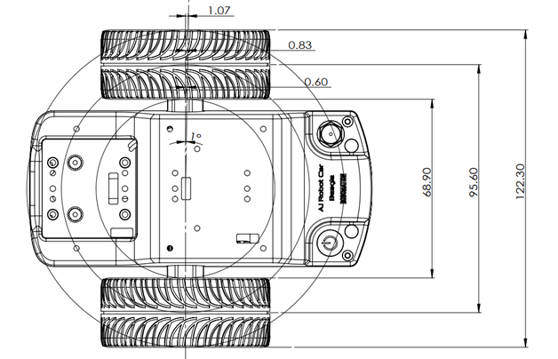
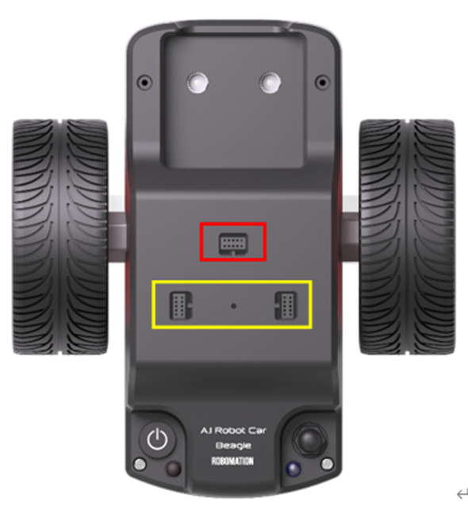

# 비글 하드웨어 사양

비글(Beagle)은 **라이다와 카메라를 얹을 수 있는 AI 로봇 카**입니다.  
로보메이션 바퀴 로봇 중 **가장 크고 빠르며**, 자이로·지자계 센서를 갖추고 있습니다.

**비글에는 제어 가능한 LED 가 없고, 바닥·근접·조도 센서도 없습니다.**  
주변을 감지하려면 별도로 장착하는 **라이다**를 사용합니다. (최대 12m, 360도)

<br>

## 0. 문서 정보

| 항목 | 내용 |
|---|---|
| 제품명 | 비글 (Beagle) / AI Robot Car |
| 분류 | 2륜 구동 바퀴 로봇 |
| 원본 자료 | 비글 기술문서 |
| 이 문서가 다루지 않는 것 | BLE 패킷, USB 동글 프로토콜, IMU 설정 패킷 |

<br>

## 1. 물리 치수



| ID | 항목 | 값 | 단위 | 비고 |
|---|---|---|---|---|
| `BEAGLE.DIM.SIZE` | 크기 | 132 × 120 × 65 | mm | 카메라 · 라이다 제외 |
| `BEAGLE.DIM.WEIGHT` | 무게 | 380 | g | 카메라 · 라이다 제외 |

<br>

## 2. 구동계

### 2.1 모터와 기어

비글의 구동부 구성입니다. 이동 거리를 계산하려면 2.2 의 환산값이 함께 필요합니다.

| ID | 항목 | 값 | 단위 | 비고 |
|---|---|---|---|---|
| `BEAGLE.DRIVE.MOTOR` | 모터 | 바이폴라 스텝 모터 × 2 | | 마이크로스테핑 |
| `BEAGLE.DRIVE.STEP_ANGLE` | 모터 스텝 각 | 15 | 도 | |
| `BEAGLE.DRIVE.MICROSTEP` | 마이크로스텝 | 1 / 8 | | |
| `BEAGLE.DRIVE.GEAR_RATIO` | 기어비 | 8 : 80 (1 : 10) | | |

### 2.2 거리 환산

바퀴 한 바퀴가 몇 mm 인지, 펄스 하나가 몇 mm 인지 계산하는 근거입니다.
거리를 지정해 움직이는 코드는 아래 값에서 나옵니다.

| ID | 항목 | 값 | 단위 | 비고 |
|---|---|---|---|---|
| `BEAGLE.DRIVE.WHEEL_DIA` | 바퀴 지름 | 66 | mm | |
| `BEAGLE.DRIVE.WHEEL_CIRC` | 바퀴 원주 | 207.3451 | mm | |
| `BEAGLE.DRIVE.TRACK_INNER` | 바퀴 축간거리 (내측) | 68.90 | mm | |
| `BEAGLE.DRIVE.TRACK_CENTER` | **바퀴 축간거리 (중앙)** | **95.60** | mm | **회전 계산의 기준** |
| `BEAGLE.DRIVE.TRACK_OUTER` | 바퀴 축간거리 (외측) | 122.30 | mm | |
| `BEAGLE.DRIVE.PULSE_PER_REV` | 바퀴 1회전 펄스 | 1,920 | 펄스 | 24스텝 × 8 마이크로스텝 × 10 |
| `BEAGLE.DRIVE.MM_PER_PULSE` | 펄스당 이동 거리 | 0.107992 | mm | |
| `BEAGLE.DRIVE.PULSE_PER_CM` | 1cm 당 펄스 | 92.59924 | 펄스 | 문서와 라이브러리 값이 일치합니다 |

### 2.3 속도

펌웨어가 속도를 다루는 내부 단위는 PPS(초당 펄스 수)입니다.  
다만 **코드에 넣는 속도 값은 `-100 ~ 100`** 입니다. 아래 PPS 값은 그대로 쓰지 않습니다. (7장 R1 참조)

| ID | 항목 | 값 | 단위 | 비고 |
|---|---|---|---|---|
| `BEAGLE.DRIVE.SPEED_RANGE` | 속도 지정 범위 | -32,768 ~ 32,767 | **PPS** | **백분율이 아닙니다** |
| `BEAGLE.DRIVE.SPEED_MIN` | 최소 유효값 | 2 | PPS | 2 이하는 0 으로 처리됩니다 |
| `BEAGLE.DRIVE.SPEED_USABLE` | **실제 유효 범위** | **약 4,000** | PPS | 그 이상은 실제로 나오지 않습니다 |
| `BEAGLE.DRIVE.SPEED_MAX` | 최대 이동 속도 | 약 43 | cm/초 | `계산값` 4,000 PPS × 0.107992mm |
| `BEAGLE.DRIVE.ACCEL` | 모터 가속 단계 | 1 ~ 14 | | 기본 5. 15 = 가속 제어 없음 |

> **거리 지정 이동에서는 가속 기능이 동작하지 않습니다.**

> **정지 후 재출발 시 스텝 손실에 주의합니다.** 8의 배수가 아닌 위치에서 멈췄다가  
> 다시 출발하면 일부 스텝을 잃을 수 있습니다. 모터 절전 모드에서 특히 그렇습니다.

<br>

## 3. 센서

### 3.1 내장 센서

비글에 실제로 들어 있는 센서는 아래가 전부입니다.

| ID | 센서 | 범위 | 비고 |
|---|---|---|---|
| `BEAGLE.SENSOR.ACC` | 가속도 (3축) | ±2 / ±4 / ±8 / ±16 G | **12비트.** 기본 ±2G (1024 LSB/G) |
| `BEAGLE.SENSOR.GYRO` | 자이로 (3축) | ±125 ~ ±2,000 °/초 | **16비트.** 기본 ±250°/초 |
| `BEAGLE.SENSOR.MAG` | 지자계 (3축) | X · Y ±1,300 / Z ±2,500 μT | 분해능 약 0.3μT |
| `BEAGLE.SENSOR.ENCODER` | 엔코더 | 32비트 정수 | 최대값에 도달하면 더 세지 않습니다 |
| `BEAGLE.SENSOR.TEMP` | 온도 | -40 ~ +87.5 °C | **기판 내부 온도** |
| `BEAGLE.SENSOR.RSSI` | 신호 세기 | -93 까지 dBm | |

부품은 자이로·가속도 **BMI055**, 지자계 **BMM150** 입니다.

### 3.2 없는 센서

**비글에는 바닥(라인) 센서 · 근접 센서 · 조도 센서 · 컬러 센서가 없습니다.**  
라인 트레이싱이나 색 인식 코드를 생성하지 않습니다.

### 3.3 라이다 (별매)

상단 전용 커넥터에 장착하는 **360도 회전형 거리 센서**입니다.

| ID | 항목 | 값 | 단위 | 비고 |
|---|---|---|---|---|
| `BEAGLE.LIDAR.MODEL` | 모델 | NanoLiDAR | | HAT-100 보드를 통해 연결 |
| `BEAGLE.LIDAR.SIZE` | 크기 | 54 × 51 × 42 | mm | 높이는 +2mm 오차 |
| `BEAGLE.LIDAR.WEIGHT` | 무게 | 55 | g | 케이블 제외 |
| `BEAGLE.LIDAR.FOV` | 감지 범위 | **360** | 도 | 회전 방향은 반시계(CCW) |
| `BEAGLE.LIDAR.RANGE_WHITE` | **측정 거리 (밝은 물체)** | **0.03 ~ 12** | m | 반사율 90% 흰색 기준 |
| `BEAGLE.LIDAR.RANGE_BLACK` | **측정 거리 (어두운 물체)** | **0.03 ~ 8** | m | 반사율 4% 검정 기준 |
| `BEAGLE.LIDAR.RANGE_MIN` | **최소 측정 거리** | **30** | mm | 이보다 가까우면 측정되지 않습니다 |
| `BEAGLE.LIDAR.RESOLUTION` | 각도 분해능 | 0.5 ~ 1.5 | 도 | **기본 1도 → 360개 방향** |
| `BEAGLE.LIDAR.RPM` | 회전 속도 | 3,600 | 도/초 | 초당 10회전 |
| `BEAGLE.LIDAR.OUTPUT_RATE` | **데이터 출력 주기** | 약 **5** | Hz | 자동으로 계산되며 오차가 있습니다 |
| `BEAGLE.LIDAR.TEMP` | **동작 온도** | **+10 ~ +45** | °C | 범위가 좁습니다 |
| `BEAGLE.LIDAR.POWER` | 공급 전원 | 5.0V, 250 | mA | 전류는 원본에 TBD 로 표기 |
| `BEAGLE.LIDAR.LASER` | 레이저 등급 | IEC-60825 Class 1 | | 파장 895 ~ 915nm |
| `BEAGLE.LIDAR.UNIT` | 측정값 단위 | mm | | |
| `BEAGLE.LIDAR.INVALID` | **측정 실패 값** | **65535** | | 그 방향을 측정하지 못했다는 뜻 |

**거리에 따른 정확도**

| 측정 거리 | 오차 | 표준편차 |
|---|---|---|
| 0.05 ~ 0.5 m | ±10 mm | 2 mm |
| 0.5 ~ 2 m | ±20 mm | 4 mm |
| 2 ~ 6.5 m | ±30 mm | 15 mm |

**방향 기준** — **0도가 로봇 전방**이며 반시계 방향으로 각도가 커집니다.  
코드에서는 0 ~ 359 의 각도로 읽거나, 8방향(전방 · 좌전방 · 좌 · 좌후방 · 후방 · 우후방 · 우 · 우전방)으로 묶어 읽습니다.

> **무효값이 섞여 나옵니다.** 측정값이 **65535** 이면 그 방향의 측정에 실패했다는 뜻이므로  
> 반드시 걸러 내야 합니다. 거리가 65,535mm 라는 뜻이 아닙니다. (7장 R3)

> 물체의 **색과 재질에 따라 측정 오차가 발생**합니다.  
> 검고 반사율이 낮은 물체는 최대 8m 까지만 측정됩니다.

## 4. 출력과 표시등

### 4.1 제어 가능

코드로 제어할 수 있는 비글의 출력 장치는 아래가 전부입니다.

| ID | 항목 | 값 | 비고 |
|---|---|---|---|
| `BEAGLE.OUT.SERVO` | 서보 모터 | **3개**, 0 ~ 180° | 기준 부품 RS-90. 정밀도 1°, 제어 주기 20ms(50Hz) |
| `BEAGLE.OUT.SERVO_SPEED` | 서보 속도 | 0 ~ 10 | 1이 가장 느리고 0은 가장 빠릅니다 |
| `BEAGLE.OUT.BUZZER` | 부저 주파수 | 27.5 ~ 6,553.5 Hz | **27.5 Hz 미만은 스피커 보호를 위해 소리가 나지 않습니다** |
| `BEAGLE.OUT.NOTE` | 음정 | 88건반, A0 ~ C8 | |
| `BEAGLE.OUT.CLIP` | 내장 사운드 | 16종 + 멜로디 4종 | |

> **서보를 조립할 때는 90°(영점)를 기준**으로 맞춥니다.  
> 서보에 붙는 구조물의 가동 범위는 1~180° 보다 좁으므로, 전 범위를 훑는 코드를 만들지 않습니다.

### 4.2 상태 표시등 — 제어 불가

아래 표시등은 펌웨어가 직접 켜고 끕니다. **코드로 색이나 점멸을 바꿀 수 없습니다.**

| 표시등 | 색 | 표시 내용 |
|---|---|---|
| 전원 스위치 LED | 적색 | 전원 · 배터리 상태 |
| 후면 충전 표시등 | 적색 | 충전 상태 |
| 후면 통신 표시등 | 청색 | 블루투스 연결 상태 |

**비글에는 코드로 제어할 수 있는 LED 가 없습니다.**

<br>

## 5. 커넥터



상단에 커넥터가 있습니다. 붉은 상자가 라이다·서보용, 노란 상자가 치즈스틱 HAT 호환입니다.

| ID | 커넥터 | 용도 | 비고 |
|---|---|---|---|
| `BEAGLE.PORT.LIDAR` | 나노라이다 전용 | 라이다 전원 + UART | |
| `BEAGLE.PORT.SERVO` | 서보 모터 | 서보 3개 | |
| `BEAGLE.PORT.HAT` | 치즈스틱 HAT 호환 | 치즈스틱 확장 보드 | 커넥터 2개 한 쌍 |
| `BEAGLE.PORT.USB` | USB-C | 충전 | |

**핀 수 · 전압 · 신호 규격은 모두 `미공개`** 입니다.

카메라(햄스터 AI 카메라)와 그리퍼를 추가로 장착할 수 있으나, **둘 다 사양이 `미공개`** 입니다.

<br>

## 6. 전원과 배터리

전원 사양입니다. 동작 시간과 충전 시간은 공개되지 않았습니다. (8.1 참조)

| ID | 항목 | 값 | 단위 | 비고 |
|---|---|---|---|---|
| `BEAGLE.POWER.BATTERY` | 배터리 | Li-Poly 3.7V, 2,500 | mAh | |
| `BEAGLE.POWER.RUNTIME` | 연속 동작 시간 | 약 70 | 분 | |
| `BEAGLE.POWER.STANDBY` | 연속 대기 시간 | 약 12 | 시간 | |
| `BEAGLE.POWER.CHARGE` | 충전 시간 | 약 3 | 시간 | |
| `BEAGLE.POWER.WARN` | 저전압 경고 | 3.5 | V | 스위치 LED 점멸 |
| `BEAGLE.POWER.LOW` | 배터리 부족 | 3.4 | V | 0.5초 간격 점멸 |
| `BEAGLE.POWER.FAIL` | **시스템 동작 정지** | 3.35 | V | |
| `BEAGLE.POWER.OVER` | 과전압 차단 | 7.0 | V | **사이렌이 울리고 전원이 차단됩니다** |

**전원 켜기** — 전원 버튼을 한 번 누릅니다. **끄기** — 1초 이상 길게 누릅니다.

<br>

## 7. 코드 생성 규칙

### R1. 코드에 넣는 속도 값은 -100 ~ 100 이다 (MUST)

**`set_wheel_speed` 의 인자 범위는 `-100 ~ 100` 입니다.** 양수는 앞으로, 음수는 뒤로, 0 은 정지입니다.  
사용자 안내도 이 범위를 기준으로 되어 있으므로, **"속도 50" 이라고 하면 그대로 `50` 을 넣습니다.**

2장의 PPS 값(지정 ±32,767 · 실제 유효 약 4,000)은 **펌웨어 내부 단위**이며 코드에 직접 넣는 값이 아닙니다.

**판정은 사용자가 단위를 붙였는지로 가릅니다.**

| 사용자 표현 | 처리 |
|---|---|
| **숫자만** (`속도 500`) · **숫자 + %** (`50%`) | `-100 ~ 100` 범위의 값으로 봅니다. 벗어나면 **범위를 알리고 조정**합니다 |
| **숫자 + PPS · 펄스** (`500 PPS`) | 내부 단위로 보고 **환산**합니다. 실제 유효 상한인 약 4,000 PPS 가 `100` 에 대응하므로 비례로 계산하고, **환산했다는 사실을 알립니다** |
| **환산할 수 없는 단위** (`30cm/초`) | 최대 이동 속도(cm/초)가 **미공개**라 환산할 근거가 없습니다. 그 사실을 알립니다 |

단위를 붙이지 않은 숫자를 PPS 로 **넘겨짚지 않습니다.**  
햄스터 · 햄스터 S · 비글 · 터틀 **네 제품 모두 인자가 `-100 ~ 100`** 이므로, 같은 표현이 제품마다 다르게 해석되면 안 됩니다.

**안내 문구 예 — 단위 없이 범위를 넘은 경우**  
> 비글의 속도 값은 -100 ~ 100 으로 지정합니다. 요청하신 500 은 범위를 벗어납니다.  
> 최대 속도로 움직이도록 100 으로 작성했습니다.  
> 초당 펄스 수로 지정하고 싶으시면 "500 PPS" 처럼 단위를 붙여 말씀해 주세요.

**안내 문구 예 — PPS 로 요청한 경우**  
> 요청하신 500 PPS 는 실제 유효 상한인 약 4,000 PPS 대비 비율로 환산하면 속도 값 `13` 에 해당합니다.  
> 그 값으로 작성했습니다.


### R2. 없는 센서를 사용하지 않는다 (MUST NOT)

**비글에는 바닥 센서 · 근접 센서 · 조도 센서 · 컬러 센서가 없습니다.**  
라인 트레이싱, 색 인식, 낭떠러지 감지 코드를 만들지 않습니다.

해당 기능이 없음을 알리고, 엔코더와 자이로를 사용하는 방식으로 대안을 제시합니다.

### R3. 라이다 값은 무효값을 걸러 낸 뒤 사용한다 (MUST)

**조건** — 라이다로 거리를 읽어 판단하는 코드

**판정** — 라이다는 **측정에 실패한 방향에 65535 를 반환**합니다.  
이를 그대로 사용하면 **"아주 멀리까지 아무것도 없다"** 고 잘못 판단합니다.

**조치** — 값을 읽은 뒤 **65535 를 제외**하고, 유효 범위 안의 값만 사용하는 코드를 만듭니다.

```
유효한 값 = 65535 가 아니고, 30mm 이상 12000mm 이하인 값
```

**안내 문구 예**  
> 라이다는 측정에 실패한 방향에 65535 를 돌려줍니다.  
> 이 값을 거르지 않으면 벽이 있는 쪽을 "아주 멀리까지 비어 있다" 로 잘못 읽습니다.  
> 유효값만 골라 판단하도록 작성했습니다.

### R4. 라이다의 물리적 한계를 벗어난 판단을 하지 않는다 (MUST)

| 제약 | 내용 |
|---|---|
| **최소 거리** | **30mm 보다 가까운 물체는 측정되지 않습니다.** "1cm 앞에서 정지" 같은 조건은 만들 수 없습니다 |
| **최대 거리** | 밝은 물체 12m, **검고 반사율이 낮은 물체는 8m** 까지입니다 |
| **정확도** | 가까울수록 정확합니다. 2m 를 넘으면 오차가 ±30mm 까지 커집니다 |
| **출력 주기** | **약 5Hz** 입니다. 더 자주 읽어도 같은 값이 나옵니다 |
| **동작 온도** | **+10 ~ +45°C** 입니다. 추운 곳에서는 동작을 보장하지 않습니다 |

**조치** — 정지 거리 기준을 정할 때 **30mm 미만이나 12m 초과를 요청받으면** 측정 범위를 벗어남을 알립니다.  
반복 주기가 5Hz 보다 빠른 코드를 만들 때는 값이 갱신되지 않는다는 점을 안내합니다.

**안내 문구 예**  
> 라이다는 3cm 보다 가까운 물체를 측정하지 못합니다.  
> 요청하신 "1cm 앞에서 정지" 는 감지 자체가 되지 않아 구현할 수 없습니다.  
> 측정 가능한 최소 거리인 5cm 를 기준으로 작성했습니다.

### R5. LED 제어 코드를 생성하지 않는다 (MUST NOT)

**비글에는 제어 가능한 LED 가 없습니다.** 켜기 · 끄기 · 색 지정이 모두 불가능합니다.  
빛이 필요하면 치즈스틱 HAT 커넥터에 확장 보드를 붙이는 방법을 안내합니다.

### R6. 통신이 끊기면 1초 만에 정지한다 (MUST)

1초 이상 명령을 받지 못하면 **모든 입력값이 0으로 초기화**됩니다.  
직접 반복문을 도는 코드를 만들 때는 이 주기를 안내합니다.

### R7. 저전압에서는 동작을 보장하지 않는다 (MUST)

**3.5V 이하에서 경고가 뜨고, 3.35V 이하에서는 시스템이 동작하지 않습니다.**  
통신과 연결은 정상이어도 모터가 제대로 돌지 않는 구간이 있습니다.  
반복 주행 코드에는 배터리 확인 코드를 함께 제시합니다.

### R8. 서보의 물리적 가동 범위는 명령 범위보다 좁다 (MUST)

서보는 1~180° 를 받지만 **서보에 붙는 구조물의 실제 가동 범위는 그보다 좁습니다.**  
움직일 수 없는 각도로 계속 명령을 주면 **서보가 고장 납니다.**  
전 범위를 훑는 코드를 기본값으로 제시하지 않고, 사용자가 확인한 안전 각도를 먼저 정하도록 안내합니다.

<br>

## 8. 미공개 · 충돌 항목

### 8.1 미공개 — 추정 금지

아래 값은 **공개되지 않았습니다.**
추정하거나 임의의 숫자로 채우지 않고, 값이 없다는 사실을 그대로 알립니다.
이 값에 의존하는 코드도 만들지 않습니다.

다만 **이동 시간 · 회전 시간처럼 로봇을 돌려 보면 눈으로 바로 확인되는 값**은 예외입니다.
어림값을 출발점으로 제시하되, **사양이 아니라 추정치임을 밝히고** 직접 맞춰 보도록 안내합니다.

| 분류 | 항목 |
|---|---|
| 전원 | 비글 본체의 동작 시간 · 대기 시간 · 충전 시간 (원본 TBD) |
| 라이다 | 소비 전류 (원본 TBD) |
| 부속품 | 카메라 사양, 그리퍼 사양(벌어짐 폭 · 파지력 · 구동 서보 번호) |
| 커넥터 | 핀 수, 공급 전압, 신호 규격 |
| 성능 | 최소 회전 반경, 최대 적재 하중, 등판 각도, 모터 토크 |

### 8.2 충돌 — 채택값과 다른 표기

원본 자료에 따라 값이 다르게 적힌 항목입니다.
코드와 설명에는 **채택값만** 사용합니다.

| 항목 | 채택값 | 다른 표기 |
|---|---|---|
| 제어 주기 | 20 ms (50Hz) | 사양표 초당 100회(10ms) |
| 속도 지정 범위 | -32,768 ~ 32,767 | 패킷 표에 -327677 ~ 32768 (오기) |

> 원본 문서가 외부 계산 파일(`로보틱스카 모터 컨트롤 제어 값.xlsx`)을 참조하고 있으나  
> 해당 파일은 기술문서에 포함되어 있지 않습니다.

<br>

## 9. 관련 문서

- [제품 하드웨어 사양 목록](README.md)  
- [치즈스틱 확장모듈](CheeseStick-Extensions.md) — HAT 커넥터에 연결하는 경우  
- [파이썬 API 메뉴얼 - 비글](https://github.com/RobomationLAB/Robomation_Python/wiki/Beagle)  
- [RobomationLAB 사용 가이드 - 비글](../docs/pages/ko/roboids/Beagle.md)
