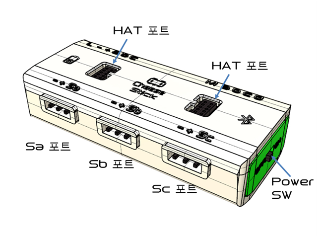
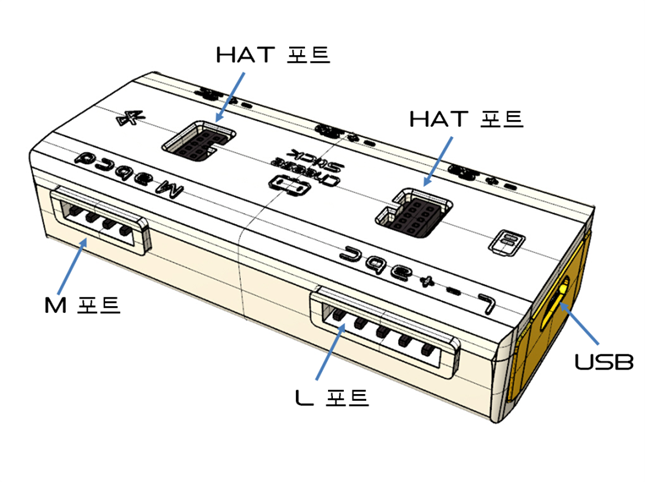

# 치즈스틱 하드웨어 사양

치즈스틱(CheeseStick)은 **확장모듈을 붙여 사용하는 컨트롤러**입니다.  
자체 구동부나 바퀴가 없고, 포트에 센서·모터·표시장치를 연결해 동작합니다.

이 문서는 **본체와 포트**를 다룹니다.  
확장모듈의 종류와 포트 호환 관계는 [치즈스틱 확장모듈](CheeseStick-Extensions.md)을 참조합니다.

 

## 0. 문서 정보

| 항목 | 내용 |
|---|---|
| 제품명 | 치즈스틱 (Cheese Stick) |
| 모델 | Cheese-Stick-0D01 |
| 분류 | 확장형 컨트롤러 |
| 원본 자료 | 치즈스틱 기술문서 |
| 이 문서가 다루지 않는 것 | BLE 패킷, 센서·모터 패킷 바이트 구조, 동글 시리얼 명령 |

 

## 1. 물리 치수와 성능

| ID | 항목 | 값 | 단위 | 근거 / 비고 |
|---|---|---|---|---|
| `CHEESESTICK.DIM.SIZE` | 크기 | 63 × 28 × 16 | mm | |
| `CHEESESTICK.DIM.WEIGHT` | 무게 | 20 | g | 배터리 포함 |
| `CHEESESTICK.SPEC.CPU` | 프로세서 | 32비트 ARM-M4, 64 | MHz | |
| `CHEESESTICK.SPEC.BLE` | 통신 | BLE 4.0 | | 통신 거리 15m |
| `CHEESESTICK.RATE.RESPONSE` | 반응 속도 | 20 | ms | 초당 50회 |
| `CHEESESTICK.SPEC.MEMORY` | 내장 메모리 · 디스플레이 | 없음 | | |

**동시에 구동할 수 있는 액추에이터**

| ID | 종류 | 최대 개수 | 비고 |
|---|---|---|---|
| `CHEESESTICK.CAP.SERVO` | 아날로그 서보 | **8** | **내부 전원으로는 5개까지.** 8개를 사용하려면 외부 전원이 필요합니다 |
| `CHEESESTICK.CAP.DC` | DC 모터 | **2** | M 포트 |
| `CHEESESTICK.CAP.STEP` | 스텝 모터 | **1** | M 포트 전체를 사용 |
| `CHEESESTICK.CAP.ANALOG_IN` | 아날로그 · 디지털 입력 | **6** | S 포트 3 + L 포트 3 |
| `CHEESESTICK.CAP.PWM` | PWM 출력 | **8** | 255 단계 |
| `CHEESESTICK.CAP.NEOPIXEL` | NeoPixel LED | **288** | Sa 핀 144 + HAT 144 |

 

## 2. 포트

### 2.1 포트 한눈에 보기

앞면입니다. **Sa · Sb · Sc 는 각각 독립된 커넥터**이며, 핀마다 `-`(GND) · `+`(VCC) · 신호선이 함께 나옵니다.  
전원 스위치도 이쪽에 있습니다.

뒷면입니다. **L 포트와 M 포트는 반대쪽 면**에 있고, 충전용 USB 단자가 옆에 있습니다.  
**HAT 포트는 윗면에 2개**로 나뉘어 있으며, 확장 보드는 두 곳에 한 번에 꽂힙니다.

| ID | 포트 | 핀 | 방향 | 주 용도 |
|---|---|---|---|---|
| `CHEESESTICK.PORT.S` | **S 포트** | Sa · Sb · Sc | 입력 / 출력 | 센서, 서보, NeoPixel |
| `CHEESESTICK.PORT.L` | **L 포트** | La · Lb · Lc (+ VCC, GND) | 입력 / 출력 | 센서, PID 확장모듈, UART |
| `CHEESESTICK.PORT.M` | **M 포트** | Ma · Mb · Mc · Md (2채널: Mab, Mcd) | **출력 전용** | DC 모터, 스텝 모터 |
| `CHEESESTICK.PORT.HAT` | **HAT 포트** | 10핀 × 2 = 20핀 | I2C | HAT 확장 보드 |
| `CHEESESTICK.PORT.USB` | Micro-USB | 5핀 | 충전 전용 | |

**HAT 포트는 방향이 없습니다.** 어느 쪽으로 꽂아도 동작합니다.

### 2.2 S 포트 (Sa · Sb · Sc)

각 핀마다 따로 모드를 정합니다.

| 모드 | 범위 | 비고 |
|---|---|---|
| 디지털 입력 | 0 / 1 | 0 = 접지에 연결됨, 1 = 열림 |
| 아날로그 입력 | 0 ~ 255 | 8비트 |
| PWM 출력 | 0 ~ 100 | 백분율 |
| 아날로그 서보 출력 | 1 ~ 180 | 도(°) |

**핀별 추가 기능**

| 핀 | 추가 기능 |
|---|---|
| `Sa` | **NeoPixel 출력.** 이 기능을 켜면 Sa 의 일반 모드 설정은 무시됩니다 |
| `Sc` | **펄스 검출 입력.** 박수·충격처럼 20ms 보다 짧은 신호를 잡습니다 |

### 2.3 L 포트 (La · Lb · Lc)

S 포트와 같은 4가지 모드를 지원하고, **여기에 더해** UART 와 PID 확장모듈 전용 통신(1-wire, I2C, 적외선 등)을 사용할 수 있습니다.  
VCC 와 GND 핀이 함께 나와 있어 **센서에 전원을 공급**할 수 있습니다.

| 핀 | 추가 기능 |
|---|---|
| `Lc` | 펄스 검출 입력 |
| 전체 | 엣지 검출 모드로 전환 가능 |

> **PID 확장모듈은 대부분 L 포트를 사용합니다.** L 포트를 일반 입출력으로 사용하면 PID 모듈을 붙일 수 없습니다.

### 2.4 M 포트 (Mab · Mcd) — 출력 전용

| 채널 | 모드 |
|---|---|
| `Mab` | 디지털 출력 / DC 모터 (±1~100) / 아날로그 서보 (0~180°, **신호만 공급**) / 부저 출력 |
| `Mcd` | 디지털 출력 / DC 모터 / 아날로그 서보 |

| ID | 항목 | 값 | 단위 | 비고 |
|---|---|---|---|---|
| `CHEESESTICK.PORT.M.CURRENT_MAX` | 채널당 최대 전류 | **500** | mA | 초과하면 동작하지 않습니다 |

- 스텝 모터는 Mab 와 Mcd 를 **함께 사용**하므로 1개만 연결됩니다.  
- 스텝 모터를 풀스텝으로 구동하면 전류가 두 배가 되므로, **소형 바이폴라 스텝 모터만** 연결합니다.  
- `Mcd` 는 부저 출력 모드를 지원하지 않습니다.

### 2.5 전기적 사양

| ID | 항목 | 값 | 비고 |
|---|---|---|---|
| `CHEESESTICK.PORT.PULLUP` | 풀업 저항 | 50 kΩ | 버튼 입력에 사용 |
| `CHEESESTICK.PORT.PULLDOWN` | 풀다운 저항 | 50 kΩ 또는 2 MΩ | |
| `CHEESESTICK.PORT.SERVO_PULSE` | 서보 펄스 폭 | 1° = 1.0ms, 90° = 1.5ms, 180° = 2.0ms | 180 초과 입력은 2.5ms 로 제한 |
| `CHEESESTICK.PORT.PWM_PERIOD` | PWM 주기 | 20 ms | |
| `CHEESESTICK.PORT.SERVO_RATE` | 서보 제어 주기 | 50 Hz | |

 

## 3. 내장 센서

확장모듈 없이 본체만으로 읽을 수 있는 값입니다.

| ID | 센서 | 범위 | 단위 | 비고 |
|---|---|---|---|---|
| `CHEESESTICK.SENSOR.ACC` | 가속도 (3축) | ±2 / ±4 / ±8 / ±16 | G | 12비트, 범위 선택 가능 |
| `CHEESESTICK.SENSOR.TEMP` | 온도 | -40 ~ +87.5 | °C | 0.5°C 단위. **기판 내부 온도이며 실내 온도가 아닙니다** |
| `CHEESESTICK.SENSOR.RSSI` | 신호 세기 | -93 까지 | dBm | 신뢰 구간 -50 ~ -80 |

가속도 센서로 **두드림(tap)** 과 **자유 낙하(fall)** 도 감지합니다.

 

## 4. 출력과 표시등

### 4.1 소리 — 제어 가능

| ID | 항목 | 범위 | 비고 |
|---|---|---|---|
| `CHEESESTICK.OUT.BUZZER` | 부저 주파수 | 27.5 ~ 4186.01 | Hz. 0.1Hz 단위 |
| `CHEESESTICK.OUT.NOTE` | 음정 | 88건반, A0 ~ C8 | 12평균율, ±0.1 cent |

### 4.2 상태 표시등 — 제어 불가

| ID | 표시등 | 색 | 표시 내용 |
|---|---|---|---|
| `CHEESESTICK.INDICATOR.POWER` | 전원 · 충전 | 적색 | 충전 상태 |
| `CHEESESTICK.INDICATOR.BLE` | 통신 | 청색 | 블루투스 연결 상태 |

본체 LED 는 **코드로 켜거나 끌 수 없습니다.**  
빛으로 무언가를 표현하려면 NeoPixel 이나 LED 확장모듈을 사용합니다.

 

## 5. 전원과 배터리

| ID | 항목 | 값 | 단위 | 근거 / 비고 |
|---|---|---|---|---|
| `CHEESESTICK.POWER.BATTERY` | 배터리 | Li-Poly 3.7V, 200 | mAh | `충돌` 개요에는 220mAh 로 표기됨 → 보수적으로 200 채택 |
| `CHEESESTICK.POWER.STANDBY` | 대기 시간 | 8 | 시간 | |
| `CHEESESTICK.POWER.RUNTIME` | 동작 시간 | 약 12 | 시간 | 모터 정지 · LED 소등 기준. 실제 사용 시 크게 줄어듭니다 |
| `CHEESESTICK.POWER.CHARGE` | 충전 시간 | 30 | 분 | Micro-USB |
| `CHEESESTICK.POWER.WARN` | 저전압 경고 | 3.45 | V | |
| `CHEESESTICK.POWER.FAIL` | 동작 보장 불가 | 3.35 | V | 이하에서 오동작 |
| `CHEESESTICK.POWER.NORMAL` | 정상 전압 범위 | 3.7 ~ 3.8 | V | 만충 시 4.0V 근처 |

> **모터를 사용하면 동작 시간이 급격히 줄어듭니다.** 12시간은 아무것도 구동하지 않을 때의 값입니다.  
> 서보 8개나 DC 모터를 사용하는 구성은 **외부 전원을 전제**로 안내합니다.

 

## 6. 코드 생성 규칙

[확장모듈 규칙](CheeseStick-Extensions.md)과 함께 적용합니다.

### R1. 포트 능력을 벗어난 사용 (MUST NOT)

| 하려는 것 | 가능한 포트 |
|---|---|
| 아날로그 · 디지털 입력 | S 포트, L 포트 |
| PWM 출력 | S 포트, L 포트 |
| 아날로그 서보 | S 포트, L 포트, M 포트 |
| DC 모터 · 스텝 모터 | **M 포트만** |
| 펄스 검출 | **Sc, Lc 만** |
| NeoPixel | **Sa 만** |
| UART | **L 포트만** |

**M 포트는 출력 전용입니다.** 센서를 연결하는 코드를 만들지 않습니다.

**안내 문구 예**  
> DC 모터는 M 포트에만 연결할 수 있습니다. Sa 핀으로는 모터를 돌릴 수 없습니다.  
> Mab 또는 Mcd 채널을 사용하도록 아래와 같이 작성했습니다.

### R2. 서보를 5개를 넘게 사용할 때는 외부 전원 (MUST)

내부 전원으로 동시에 구동할 수 있는 아날로그 서보는 **5개**입니다.  
6개 이상을 사용하는 코드를 만들 때는 **외부 전원이 필요하다는 사실을 반드시 함께 알립니다.**

### R3. M 포트 500mA 를 넘기지 않는다 (MUST)

채널당 500mA 입니다. 스텝 모터를 풀스텝으로 구동하면 전류가 두 배가 되므로  
**소형 바이폴라 스텝 모터만** 연결할 수 있습니다.

### R4. 온도 센서를 실내 온도로 사용하지 않는다 (MUST NOT)

내장 온도 센서는 **기판 내부 온도**입니다. 실내 온도나 물체 온도로 사용하는 코드를 만들지 않습니다.  
실내 온도가 필요하면 PID26 환경 센서를 사용하도록 안내합니다.

### R5. 본체 LED 제어 코드를 생성하지 않는다 (MUST NOT)

치즈스틱 본체의 전원 · 통신 LED 는 코드로 제어할 수 없습니다.  
빛이 필요하면 **NeoPixel** 이나 **CSD02 RGB LED** 확장모듈을 사용하는 코드를 제시합니다.

### R6. 저전압에서는 동작을 보장하지 않는다 (MUST)

**3.45V 이하에서 경고가 뜨고, 3.35V 이하에서는 오동작합니다.**  
모터나 서보를 사용하는 코드에는 배터리 확인 코드를 함께 제시합니다.

 

## 7. 미공개 · 충돌 항목

### 7.1 미공개 — 추정 금지

| 분류 | 항목 |
|---|---|
| 전원 | S 포트 · L 포트의 핀당 최대 전류 |
| 전원 | 외부 전원 입력 규격(전압 · 커넥터) |
| 포트 | HAT 포트 20핀의 핀 배치 |
| 성능 | 모터 사용 시 실제 동작 시간 |

### 7.2 충돌 — 채택값과 다른 표기

| 항목 | 채택값 | 다른 표기 |
|---|---|---|
| 배터리 용량 | 200 mAh | 개요 200mA / 사양표 220mA |
| 지원 OS | Android 4.4 이상 | 개요에는 4.3 이상 |

 

## 8. 관련 문서

- [제품 하드웨어 사양 목록](README.md)  
- [치즈스틱 확장모듈](CheeseStick-Extensions.md)  
- [파이썬 API 메뉴얼 - 치즈스틱](https://github.com/RobomationLAB/Robomation_Python/wiki/CheeseStick)  
- [RobomationLAB 사용 가이드 - 치즈스틱](../docs/pages/ko/roboids/CheeseStick.md)
