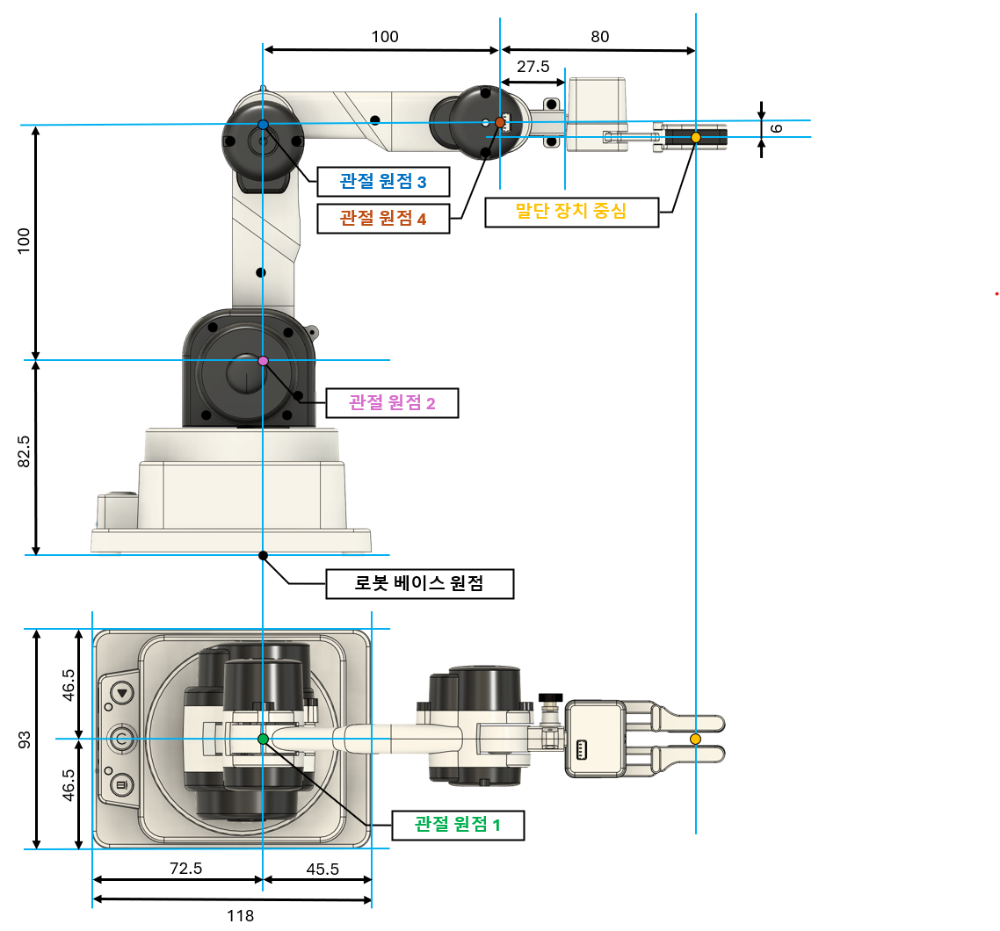
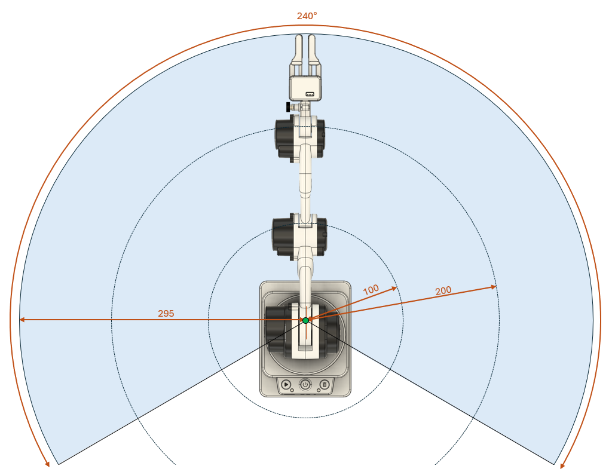
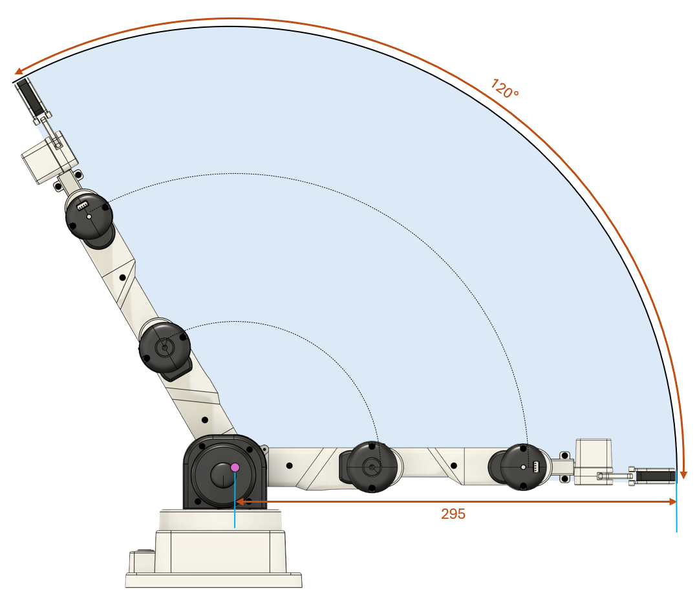
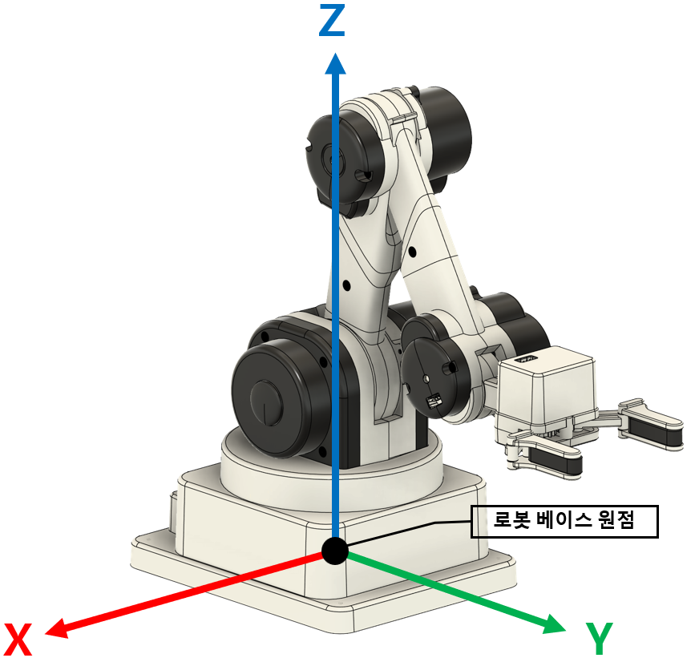
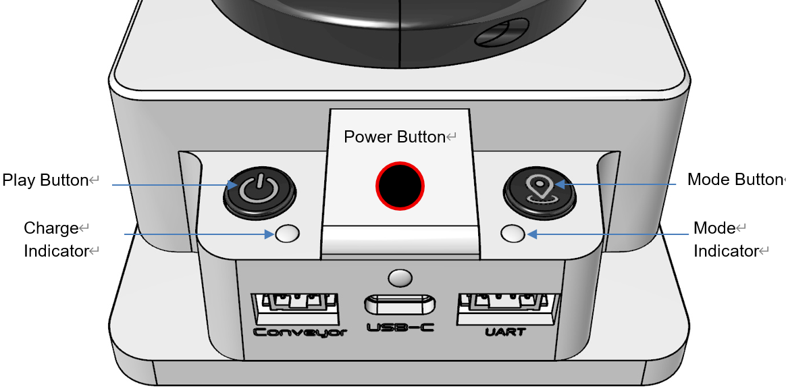

# 라쿤봇 하드웨어 사양

라쿤봇(RaccoonBot)은 **4축 관절형 로봇 팔**입니다.  
관절 속도 또는 각도를 제어해 팔을 움직이고, 손목 끝에는 말단장치를, 별도 포트에는 주변장치를 연결해 사용합니다.  

이 문서는 라쿤봇 **본체 · 말단장치 · 컨베이어 · 슬라이드 베이스**의 물리 사양을 다룹니다.  
함수 사용법은 13장의 API 문서를 참조합니다.

 

## 0. 문서 정보

| 항목 | 내용 |
|---|---|
| 제품명 | 라쿤봇 (Raccoon Robot Arm) |
| 분류 | 4축 관절형 로봇 팔 |
| 구성 | 본체 + 말단장치(선택) + 주변장치(선택) |
| 원본 자료 | 라쿤봇 본체 · 말단장치 · 컨베이어 · 슬라이드 베이스 기술문서 |
| 이 문서가 다루지 않는 것 | BLE 패킷, 시리얼 프로토콜, 튜터 모드, 공장 검사 절차 |

 

## 1. 본체 물리 치수

| ID | 항목 | 값 | 단위 | 근거 / 비고 |
|---|---|---|---|---|
| `RACCOON.DIM.SIZE` | 크기 (가로 × 세로 × 높이) | 93 × 118 × 180 | mm | |
| `RACCOON.DIM.WEIGHT` | 무게 | 825 | g | 그리퍼 제외 |
| `RACCOON.DIM.PARKED` | 파킹 시 점유 공간 | 100 × 120 × 180 | mm | `충돌` 개요에는 풋프린트 120 × 95mm 로도 적혀 있음. 크기 표의 93 × 118 과 불일치 |
| `RACCOON.DIM.DOF` | 자유도 | 4 | 축 | |

**설치** — 무게 배분 설계로 별도 고정이 필요 없습니다. 필요하면 클램프를 사용합니다.  
(클램프 규격·볼트 홀 패턴은 `미공개`)

 

## 2. 본체 구동계

### 2.1 링크 길이

관절 사이의 거리입니다. 작업영역 계산의 근거가 됩니다.

베이스 원점은 **바닥면, J1 회전축 위**에 있습니다.  
거기서 어깨(J2)까지 82.5mm, J2~J3 와 J3~J4 가 각각 100mm 입니다.  
**말단장치 중심(TCP)은 J4 에서 80mm 앞, 축선보다 6mm 아래**에 있습니다.

| ID | 항목 | 값 | 단위 | 근거 / 비고 |
|---|---|---|---|---|
| `RACCOON.DRIVE.L1` | 바닥 → J2 (베이스 높이) | 82.5 | mm | 치수 도면 |
| `RACCOON.DRIVE.L2` | J2 → J3 | 100 | mm | 치수 도면 |
| `RACCOON.DRIVE.L3` | J3 → J4 | 100 | mm | 치수 도면 |
| `RACCOON.DRIVE.L4_OFFSET` | J4 → 말단장치 결합면 | 27.5 | mm | 치수 도면 |

### 2.2 모터와 감속기

| ID | 항목 | J1 | J2 | J3 | J4 | 단위 |
|---|---|---|---|---|---|---|
| `RACCOON.DRIVE.STEP_ANGLE` | 모터 스텝 각 | 11.25 | 7.5 | 11.25 | 11.25 | 도/스텝 |
| `RACCOON.DRIVE.GEAR_RATIO` | 감속비 | 32.96 | 42.5 | 64 | 64 | : 1 |
| `RACCOON.DRIVE.DEG_PER_STEP` | 관절 회전 분해능 | 0.0427 | 0.0441 | 0.0439 | 0.0439 | 도 |

- 모터는 마이크로 스테퍼 4개이며, 16 마이크로스텝 중 **4스텝 단위**로 제어합니다.  
- 전 축이 비접촉식 자계 엔코더를 갖고 있어 **전원을 켤 때 초기 위치를 찾는 동작이 필요 없습니다.**

| ID | 항목 | 값 | 단위 | 근거 / 비고 |
|---|---|---|---|---|
| `RACCOON.DRIVE.ENCODER_BITS` | 엔코더 분해능 | 12 | bit | 4096 단계 / 360도 |
| `RACCOON.DRIVE.ENCODER_DEG` | 엔코더 1카운트 | 0.088 | 도 | 360 / 4096 |

### 2.3 속도

관절과 컨베이어의 속도 단위입니다.

| ID | 항목 | 값 | 단위 | 근거 / 비고 |
|---|---|---|---|---|
| `RACCOON.DRIVE.SPEED_RANGE` | 관절 속도 | -100 ~ 100 | % | 음수는 역방향, 0은 정지 |
| `RACCOON.DRIVE.SPEED_DEG_S` | 최대 각속도 | `미공개` | 도/초 | 백분율과 실제 각속도의 대응이 공개되지 않음 |
| `RACCOON.DRIVE.ACCEL` | 가속도 한계 | `미공개` | | |
| `RACCOON.DRIVE.TORQUE` | 관절 토크 | `미공개` | | 충돌 감지와 토크 제어는 있으나 수치 없음 |
| `RACCOON.DRIVE.PAYLOAD` | 가반 하중 | `미공개` | g | |

> **각도 제어 모드의 속도는 상한값입니다.** 실제 이동 속도는 이동해야 할 각도 범위에 따라 자동으로 결정됩니다.

 

## 3. 동작 한계 — 관절 범위와 작업영역

### 3.1 관절 회전 범위

**이 표를 벗어나는 각도는 어떤 방법으로도 만들 수 없습니다.**

각 관절이 **실제로 움직일 수 있는** 범위입니다.
명령으로 넣을 수 있는 값의 범위와 다르며, 이 범위를 벗어난 각도는 무시되거나 한계값으로 잘립니다.

| ID | 관절 | 최소 | 최대 | 가동 폭 | 설명 |
|---|---|---|---|---|---|
| `RACCOON.JOINT.J1.RANGE` | J1 (베이스 회전) | -120° | +120° | 240° | 좌우 회전. **360° 회전 불가** |
| `RACCOON.JOINT.J2.RANGE` | J2 (어깨) | -90° | +30° | 120° | |
| `RACCOON.JOINT.J3.RANGE` | J3 (팔꿈치) | -150° | 0° | 150° | **양수 각도 불가** |
| `RACCOON.JOINT.J4.RANGE` | J4 (손목) | -105° | +105° | 210° | |

### 3.2 극한 자세 — 관절 제어 기준

관절을 한계까지 뻗었을 때의 값입니다. 링크 길이를 그대로 더한 값이며 `계산값` 입니다.

**팔을 앞으로 완전히 뻗은 자세** (J2 = -90°, J3 = 0°, J4 = 0°)

| ID | 기준점 | 수평 도달 거리 | 그때의 높이 | 계산 |
|---|---|---|---|---|
| `RACCOON.WORK.REACH_WRIST` | 손목 | **200.0 mm** | 82.5 mm | L2 + L3 |
| `RACCOON.WORK.REACH_MAX` | 기본 그리퍼 끝 (열림) | **280.0 mm** | 76.5 mm | L2 + L3 + 80 |
| `RACCOON.WORK.REACH_CLOSED` | 기본 그리퍼 끝 (닫힘) | **290.0 mm** | 76.5 mm | L2 + L3 + 90 |
| `RACCOON.WORK.REACH_VACUUM` | 진공 그리퍼 끝 | **275.0 mm** | 82.5 mm | L2 + L3 + 75 |

기본 그리퍼만 높이가 82.5mm 가 아닌 76.5mm 인 것은, 그리퍼가 관절 중심선보다 **6mm 아래**에 물리는 구조이기 때문입니다.  
진공 그리퍼는 이 오프셋이 없어 정확히 L1 높이에 옵니다.

**팔을 위로 완전히 세운 자세** (J2 = 0°, J3 = 0°, J4 = 0°)

| ID | 기준점 | 최대 높이 | 계산 |
|---|---|---|---|
| `RACCOON.WORK.Z_MAX_WRIST` | 손목 | **282.5 mm** | L1 + L2 + L3 |
| `RACCOON.WORK.Z_MAX` | 기본 그리퍼 끝 | **362.5 mm** | L1 + L2 + L3 + 80 |
| `RACCOON.WORK.Z_MAX_VACUUM` | 진공 그리퍼 끝 | **357.5 mm** | L1 + L2 + L3 + 75 |

**팔을 아래로 접은 자세** (J2 = -90°, J3 = -90°, J4 = 0°)

| ID | 기준점 | 최저 높이 | 그때의 반경 |
|---|---|---|---|
| `RACCOON.WORK.Z_MIN_WRIST` | 손목 | **-17.5 mm** | 100 mm |
| `RACCOON.WORK.Z_MIN` | 기본 그리퍼 끝 | **-97.5 mm** | 100 mm |

높이가 음수인 것은 베이스가 놓인 면보다 아래라는 뜻입니다. 4.1 을 참조합니다.

| ID | 항목 | 값 | 단위 | 비고 |
|---|---|---|---|---|
| `RACCOON.WORK.YAW` | 수평 회전 범위 | 240 | 도 | J1 범위와 동일. 360° 회전 불가 |

> **295mm 와 280mm 은 서로 다른 점을 잰 값입니다. 충돌이 아닙니다.**  
>  
> - **280mm** — 소프트웨어가 좌표 계산에 사용하는 **말단장치 중심(TCP)** 까지의 거리입니다.  
>   좌표로 위치를 지정할 때는 이 값이 한계입니다.  
> - **295mm** — 집게를 닫았을 때 **집게 끝이 물리적으로 닿는** 거리입니다.  
>   제품 사양서와 작업영역 도면이 사용하는 값이며, TCP 보다 약 15mm 더 나갑니다.  
>  
> 코드 생성에는 **280mm(TCP 기준)** 을 적용합니다.  
> 물체를 놓을 자리를 정할 때처럼 실제 집게가 닿는 범위를 말해야 하면 295mm 를 안내합니다.

### 3.3 좌표 제어로 지정할 수 있는 범위

> **관절 각도로 갈 수 있는 자세와, 좌표로 지정할 수 있는 자세는 다릅니다.**  
> 좌표로 위치를 지정하면 손목 고정 모드가 말단장치의 **자세까지 함께 구속**합니다.  
> 가장 큰 차이는 높이입니다. 기본 그리퍼 끝은 관절 제어로는 **362.5mm** 까지 올라가지만,  
> 좌표 제어로는 **200mm** 까지만 지정할 수 있습니다.  
> 팔을 높이 들어야 하는 동작은 좌표가 아니라 **관절 각도로 지정**합니다.

#### 도달 판정 — 어깨 거리 규칙

라쿤봇의 팔은 **어깨 관절 한 점을 중심으로** 움직입니다.  
어깨는 베이스 회전축 위, 바닥에서 **82.5mm** 높이에 있습니다.

윗팔과 아래팔이 둘 다 100mm 이므로, 어깨에서 손목까지의 거리는 다음 범위를 벗어날 수 없습니다.

| ID | 항목 | 값 | 설명 |
|---|---|---|---|
| `RACCOON.WORK.SHOULDER_Z` | 어깨 높이 | 82.5 mm | 회전축 위 |
| `RACCOON.WORK.D_MAX` | 어깨 ~ 손목 최대 거리 | 200.0 mm | L2 + L3. 팔을 완전히 편 상태 |
| `RACCOON.WORK.D_MIN` | 어깨 ~ 손목 최소 거리 | 51.8 mm | J3 가 -150° 까지만 접히기 때문 |

즉 도달 가능한 영역은 **어깨를 중심으로 한 반지름 51.8mm ~ 200mm 의 공 껍질**이며,  
여기에 좌우 회전 ±120° 제한이 더해집니다.

위에서 본 모습입니다. 파란 영역이 닿는 범위이고, 아래쪽 빈 부채꼴은 닿지 않습니다.  
좌우로 **240°**, 회전축에서 최대 **295mm** 까지입니다. (295mm 의 기준은 3.2 참조)

옆에서 본 모습입니다. **100mm · 200mm 호가 어깨 관절을 중심으로** 그려져 있습니다.  
바깥쪽 호가 팔을 완전히 편 200mm 한계이며, 그 밖으로는 어떤 자세로도 나갈 수 없습니다.

**판정 절차**

1. 목표 좌표 (x, y, z) 에서 **손목 위치**를 구합니다. 말단장치 길이만큼 되돌리는 계산입니다.

   | 기준 | 손목까지의 수평 거리 | 손목의 높이 |
   |---|---|---|
   | 손목 | √(x² + y²) | z |
   | 기본 · 서보 그리퍼 · 수평 고정 | √(x² + y²) − 80 | z + 6 |
   | 기본 · 서보 그리퍼 · 수직 고정 | √(x² + y²) + 6 | z + 80 |
   | 진공 그리퍼 · 수평 고정 | √(x² + y²) − 75 | z |
   | 진공 그리퍼 · 수직 고정 | √(x² + y²) | z + 75 |

2. 어깨에서 손목까지의 거리를 구합니다.  
   **d = √( 손목수평거리² + (손목높이 − 82.5)² )**

3. 아래를 **모두** 만족하면 도달 가능합니다.  
   - `51.8 ≤ d ≤ 200.0` (단위 mm)  
   - 좌우 회전각 `|atan2(y, x)| ≤ 120°`

이 규칙은 **도달 가능한 지점을 잘못 막는 일이 없습니다.**  
반대로 이 규칙을 통과했지만 관절 한계 때문에 실제로는 못 가는 지점이 일부 남는데,  
그런 좌표는 라이브러리가 실행 시점에 `coordinates within the workspace` 오류로 걸러 냅니다.  
**로봇이 잘못 움직이지는 않습니다.**

#### 모드별 바깥 경계

위 판정을 하기 전에 빠르게 걸러 내는 용도입니다.  
**이 범위 안에 들어왔다고 해서 도달 가능한 것은 아닙니다.** 반드시 어깨 거리 규칙까지 확인합니다.

| 기준 | x (mm) | y (mm) | z (mm) | 최대 수평 도달 |
|---|---|---|---|---|
| 손목 | -96 ~ +196 | -196 ~ +196 | -14 ~ +282 | 200 mm |
| 기본 그리퍼 · 수평 고정 | -136 ~ +276 | -276 ~ +276 | -22 ~ +274 | 280 mm |
| 기본 그리퍼 · 수직 고정 | -96 ~ +192 | -192 ~ +192 | -94 ~ +202 | 193 mm |

x 의 음수 쪽이 좁은 것은 **좌우 회전이 ±120° 로 제한**되어 뒤쪽 120° 구간에는 팔이 닿지 않기 때문입니다.  
z 가 음수인 구간은 베이스가 놓인 면보다 아래이므로 4.1 을 참조합니다.

## 4. 좌표계와 기준 자세

| 항목 | 내용 |
|---|---|
| 원점 | **바닥면(작업 테이블 평면), J1 회전축 위** |
| 단위 | mm 또는 cm (라이브러리는 cm 기본, mm · inch 선택 가능) |
| Z | 위쪽이 양수 |
| Y | J1 이 0° 일 때 **팔이 뻗는 방향**이 양수 |
| X | Y 에 수직. J1 을 **양수 방향으로 돌리면 X 가 음수**로 갑니다 |
| 기준 자세 (Home) | **전원을 켰을 때의 최초 기준 자세**입니다. |
| 영점 자세 (Zero) | **모든 관절 각도가 0도**인 자세입니다. 팔이 위로 곧게 선 모습을 합니다. |
| 파킹 자세 (Park) | 제품 포장 시와 같은 모양의 격납 자세입니다. |

**세 자세의 관절 각도와 위치**

| 자세 | J1 | J2 | J3 | J4 | 손목 위치 (반경, 높이) | 기본 그리퍼 끝 |
|---|---|---|---|---|---|---|
| 영점 (Zero) | 0° | 0° | 0° | 0° | 0 mm, 282.5 mm | 6 mm, 362.5 mm |
| 기준 (Home) | 0° | -10° | -140° | 60° | 67 mm, 94 mm | 147 mm, 88 mm |
| 파킹 (Park) | 0° | 25° | -145° | -60° | 44 mm, 123 mm | 38 mm, 43 mm |

영점 자세는 팔이 **위로 곧게 선** 모습이라 손목이 가장 높은 282.5mm 에 옵니다. (3.2 참조)  
기준 자세는 팔을 접어 **앞쪽을 향한** 자세이고, 파킹 자세는 더 낮게 접어 넣은 자세입니다.  
영점 자세는 전원을 끈 상태에서 손으로 맞추며, J1 각도를 몸체의 돌기에 일치시킵니다.

**손목 고정 모드** — 말단장치의 자세를 고정하는 설정이며, 좌표 제어 시 도달 가능 영역이 달라집니다.

| 모드 | 말단장치 자세 | 용도 |
|---|---|---|
| `horizontal` | 수평 유지 | 옆에서 집기, 멀리 뻗기 |
| `vertical` | 수직(아래) 유지 | 위에서 내려 집기 |
| `none` | 고정 없음 | 좌표 제어에서는 수평과 동일하게 계산됨 |

> **좌표 지정은 고정 모드에 따라 결과가 달라집니다.** 같은 좌표라도 수평에서는 도달하고  
> 수직에서는 도달하지 못할 수 있습니다. 3.3 의 어깨 거리 규칙으로 확인합니다.

### 4.1 베이스 면보다 낮은 높이 (z < 0)

수직 고정 자세에서는 기하학적으로 **z = -97.5mm 까지** 계산됩니다.  
이는 베이스가 놓인 면보다 아래라는 뜻이므로, **책상 위에 올려놓고 사용하는 보통의 경우에는 닿을 수 없습니다.**

z 가 음수인 좌표는 라쿤봇을 책상 모서리에 두고 아래쪽으로 작업하는 구성에서만 유효합니다.  
그런 설치라는 확인 없이 음수 z 를 사용하는 코드를 생성하지 않습니다.

**엔코더 표시 위치 주의** — 관절의 실제 엔코더 위치는 외부 표시의 검은 원 중앙이 아니라  
그 안 노란 원의 중심입니다.

 

## 5. 표시장치와 입력

### 5.1 상태 표시등 — 제어 불가

라쿤봇에는 LED 가 있지만 **모두 펌웨어가 직접 제어하며, 코드로 켜거나 끌 수 없습니다.**  
색이나 밝기를 지정하는 기능도, 현재 상태를 읽는 기능도 없습니다.

| ID | 위치 | 표시 내용 |
|---|---|---|
| `RACCOON.INDICATOR.WRIST` | 손목 (J4) | 관절 · 말단장치 상태 |
| `RACCOON.INDICATOR.POWER` | 버튼 부근 | 전원 및 충전 상태 (충전 중 적색) |
| `RACCOON.INDICATOR.BLE` | 버튼 부근 | 블루투스 연결 상태 |

원본 사양표는 이를 상태 LED · 모드 LED · 관절 상태 LED 로 적고 있으며, 각 RGB 7색입니다.

> **라쿤봇에는 LED 를 켜는 기능이 없습니다.** 다른 제품의 사용법을 유추해 적용하지 않습니다. (11장 R8)  
> 다른 제품의 사용법을 유추해 적용하지 않습니다.

### 5.2 소리

| ID | 항목 | 값 | 비고 |
|---|---|---|---|
| `RACCOON.OUT.SOUND_NOTE` | 음정 | 88건반, A0 ~ C8 | 12평균율, ±0.1 cent |

소리는 **코드로 제어할 수 있습니다.** 음정과 내장 사운드를 낼 수 있습니다.

### 5.3 입력

라쿤봇 본체에서 입력을 받을 수 있는 장치입니다.

| ID | 항목 | 값 | 비고 |
|---|---|---|---|
| `RACCOON.IN.BUTTON` | 버튼 | 3 개 | Play · Power · Mode (본체 전면) |
| `RACCOON.IN.PICK` | Pick 버튼 | 1 개 | J2 하우징에 별도 배치 |

### 5.4 처리 주기

센서를 읽거나 명령을 보내는 코드의 주기를 정할 때 쓰는 값입니다.

| ID | 항목 | 값 | 단위 | 비고 |
|---|---|---|---|---|
| `RACCOON.RATE.SENSOR` | 센서 감지 주기 | 100 | 회/초 | |
| `RACCOON.RATE.MOTOR` | 모터 제어 주기 | 100 | 회/초 | |
| `RACCOON.RATE.COMM` | 통신 주기 | 15 ~ 30 | ms | 약 50회/초 |
| `RACCOON.MOTION.MAX` | 저장 가능 모션 수 | 250 | 개 | 저장 내구 최소 6만 회 |

 

## 6. 포트

본체 전면에 3개의 단자가 있습니다.

왼쪽부터 **Conveyor(주변장치 4핀) · USB-C · UART(말단장치 4핀)** 순입니다.  
윗줄에는 Play · Power · Mode 버튼과 충전 표시등 · 모드 표시등이 있습니다.

| ID | 포트 | 규격 | 연결 대상 | 동시 연결 |
|---|---|---|---|---|
| `RACCOON.PORT.USB` | USB-C | 통신 겸 충전 | PC, 충전기 | 1 |
| `RACCOON.PORT.PERIPHERAL` | 4핀 (Conveyor 표기) | 전원 + 시리얼 | 컨베이어 (슬라이드 베이스는 미출시) | **1** |
| `RACCOON.PORT.EE` | 4핀 (UART 표기) | 전원 + 시리얼 | 말단장치 | **1** |

- 말단장치는 **J4(손목)에 연결**되며, 장치 종류를 자동으로 인식합니다.  
- 주변장치 포트에는 **한 번에 하나만** 연결합니다. 현재 출시된 주변장치는 컨베이어뿐입니다.  
- 케이블 확장기로 여러 대를 연결할 수 있으나, **연결 가능한 수는 총 소모 전류에 따라 달라집니다.**  
  (전류 예산 수치는 `미공개`)

**주변장치 커넥터 핀 배열**

| 핀 | 신호 |
|---|---|
| 1 | 전원 5V |
| 2 | GND |
| 3 | UART TX |
| 4 | UART RX |

- 커넥터 부품: YEONHO 20022WR-04 / 상대 부품 20022HS-4  
- 통신 전압: LVTTL (3.0 ~ 3.6 V). RS-232-C 아님  
- 본체와 주변장치 연결에는 **TX/RX 가 교차된 크로스 케이블(25cm)** 을 사용합니다  
- `충돌` 기판 실크 인쇄 순서는 `Rx Tx − +` 로 위 표와 순서가 다릅니다. 배선 전 실물 확인 필요

> 원본 기술문서의 `참고4: End-Effector Port` 와 `참고5: Peripheral Port` 는 **제목만 있고 본문이 비어 있습니다.**  
> 위 내용은 사양표 · 외형 도면 · 컨베이어 문서에서 재구성한 것입니다.  
> 말단장치 포트의 공급 전압과 전류 한계는 `미공개` 입니다.

 

## 7. 전원과 배터리

| ID | 항목 | 값 | 단위 | 비고 |
|---|---|---|---|---|
| `RACCOON.POWER.BATTERY` | 배터리 | Li-Poly 3.7V 3,500 | mAh | 과보호 회로(PCM) 내장 |
| `RACCOON.POWER.RUNTIME` | 연속 동작 시간 | 약 1 | 시간 | |
| `RACCOON.POWER.STANDBY` | 연속 대기 시간 | 최대 8 | 시간 | |
| `RACCOON.POWER.CHARGE` | 충전 시간 | 약 3 | 시간 | USB-C. 빠른 충전은 전원 스위치 OFF 상태 |
| `RACCOON.POWER.WARN` | 저전압 경고 | 3.45 | V | 적색 LED 점멸 |
| `RACCOON.POWER.FAIL` | 동작 보장 불가 | 3.25 | V | 이하에서 동작 오류 발생 가능 |
| `RACCOON.POWER.NORMAL` | 정상 전압 범위 | 3.7 ~ 3.8 | V | 만충 시 4.0V 근처 |
| `RACCOON.POWER.AUTO_OFF` | 자동 전원 차단 | 30 | 분 | 언플러그드 모드에서만 |

**보호 기능** — 고전압 입력 경고, 과전류 방지, 배터리 관리 회로를 내장합니다.

**통신 거리** — BLE 5.0 또는 시리얼, **5m 이내**. 수신 감도는 -93dBm 까지이며 신뢰 구간은 -50 ~ -80dBm 입니다.

 

---

## 8. 말단장치 (End Effector)

손목(J4) 끝에 연결하는 장치입니다. **연결하면 자동으로 인식**되므로 종류를 코드에서 지정할 필요가 없습니다.

### 8.1 연결 규격

말단장치(그리퍼 등)를 본체에 붙이는 방식입니다.

| ID | 항목 | 값 | 비고 |
|---|---|---|---|
| `RACCOON.EE.PORT` | 연결 위치 | J4 (손목) | 4핀 커넥터, 전원 + 시리얼 |
| `RACCOON.EE.UART` | 통신 | UART 115200-8-N-1 | |
| `RACCOON.EE.RATE` | 데이터 교환 주기 | 50 | Hz |
| `RACCOON.EE.COUNT` | 동시 연결 수 | **1** | |
| `RACCOON.EE.TIMEOUT` | 명령 두절 시 동작 | 1초 후 자동 OFF / Sleep | |
| `RACCOON.EE.VOLTAGE` | 공급 전압 | `미공개` | |

### 8.2 실제로 제공되는 말단장치

소비자에게 제공되는 것은 **통합 그리퍼와 진공 그리퍼 두 가지**입니다.

| 장치 | 길이 | 동작 | 비고 |
|---|---|---|---|
| 통합 그리퍼 | 80 mm | 집기 / 놓기 | 기본 제공 |
| 진공 그리퍼 | 75 mm | 집기(흡착) / 놓기(해제) | 초소형 진공 펌프 내장 |
| 서보 그리퍼 | 80 mm | 집기 / 놓기 | 출하되지만 **각도 제어 기능이 제공되지 않아 통합 그리퍼와 동일하게 동작**합니다 |

세 장치 모두 자동으로 인식되며, 코드에서 종류를 지정할 필요가 없습니다.  
서보 그리퍼는 통합 그리퍼와 길이가 같으므로 **작업영역 계산도 동일**합니다. (3.3 참조)

### 8.3 제공되지 않는 장치

아래는 원본 기술문서에 정의만 있고 **실제로 제공되지 않습니다.** 관련 코드를 생성하지 않습니다.

| 장치 | 상태 |
|---|---|
| DC 그리퍼 | 미완성 (원본 문서에 TBD 로 표기) |
| 컬러 센서 | 미완성 (원본 문서에 TBD 로 표기) |

부속품으로 펜 홀더 · 지게차 · 클리커 · 드럼 스틱이 언급되지만 **치수와 사양은 `미공개`** 입니다.

### 8.4 동작 — 집기와 놓기 두 가지뿐

**말단장치는 집기와 놓기 두 동작만 지원합니다.**  
벌림 정도를 백분율이나 각도로 지정하는 기능은 **제공되지 않습니다.**

| 장치 | 집기 | 놓기 |
|---|---|---|
| 통합 · 서보 그리퍼 | 닫힘 | 열림 |
| 진공 그리퍼 | 펌프 ON · 솔레노이드 OFF (흡착) | 펌프 OFF · 솔레노이드 ON (해제) |

읽을 수 있는 것은 **연결된 장치의 종류**와 **현재 상태** 두 가지입니다.

### 8.5 공통 미공개 항목

**모든 그리퍼에 공통으로 다음 값이 없습니다.** 이 값에 의존하는 코드를 만들지 않습니다.

아래 값은 **공개되지 않았습니다.**
추정하거나 임의의 숫자로 채우지 않고, 값이 없다는 사실을 그대로 알립니다.
이 값에 의존하는 코드도 만들지 않습니다.

다만 **이동 시간 · 회전 시간처럼 로봇을 돌려 보면 눈으로 바로 확인되는 값**은 예외입니다.
어림값을 출발점으로 제시하되, **사양이 아니라 추정치임을 밝히고** 직접 맞춰 보도록 안내합니다.

| ID | 항목 |
|---|---|
| `RACCOON.EE.FORCE` | 파지력 (N) |
| `RACCOON.EE.STROKE` | 집게 벌어짐 폭 (mm) |
| `RACCOON.EE.OBJECT_MAX` | 집을 수 있는 최대 물체 크기 |
| `RACCOON.EE.PAYLOAD` | 최대 들 수 있는 무게 |

 

---

## 9. 컨베이어

주변장치 포트에 연결하는 벨트 이송 장치입니다.

| ID | 항목 | 값 | 단위 | 근거 / 비고 |
|---|---|---|---|---|
| `RACCOON.CONVEYOR.SIZE` | 크기 (폭 × 길이 × 높이) | 79 × 420 × 32 | mm | `충돌` 외관 도면에는 500 × 40 × 25mm 로 표기됨 |
| `RACCOON.CONVEYOR.WEIGHT` | 무게 | 380 | g | 케이블 제외 |
| `RACCOON.CONVEYOR.TRAVEL` | **이송 가능 거리** | 390 | mm | 전/후진 |
| `RACCOON.CONVEYOR.BELT_WIDTH` | 벨트 폭 | 43 | mm | `충돌` 도면 40mm |
| `RACCOON.CONVEYOR.SPEED_MAX` | **최대 이송 속도** | 40 | mm/s | |
| `RACCOON.CONVEYOR.SPEED_RANGE` | 속도 지정 범위 | -100 ~ 100 | % | 100단계 |
| `RACCOON.CONVEYOR.DIST_UNIT` | 거리 지정 단위 | 1 | mm | |
| `RACCOON.CONVEYOR.ENCODER` | 엔코더 분해능 | 0.1 | mm | 상대 위치 |
| `RACCOON.CONVEYOR.GEAR` | 감속기 | 1/32 | | 마이크로 스텝 스테퍼 모터 |
| `RACCOON.CONVEYOR.VOLTAGE` | 입력 전압 | 5 | V | 라쿤봇 내부 배터리 또는 USB |
| `RACCOON.CONVEYOR.PAYLOAD` | 이송 가능 하중 | `미공개` | | 문서에는 "무거운 물건의 이송에는 적합하지 않다" 라고만 적혀 있음 |

- 벨트는 실리콘이며 텐셔너가 없습니다.  
- 본체에 Start/Stop 택트 스위치가 있습니다.  
- **1초 이상 명령이 끊기면 모터와 LED 가 꺼집니다.**

> **되읽은 이동 거리의 단위 주의** — 이동 거리 명령은 mm 단위이지만,  
> 현재 이동 거리를 되읽으면 **0.1mm 단위가 아니라 펄스 수가 그대로 나옵니다.**  
> (원본 문서에 TBD 로 명시된 미완성 항목)

 

---

## 10. 슬라이드 베이스 (미출시 · TBD)

> **아직 정식 출시되지 않은 제품입니다.**  
> 아래 사양은 개발 중 자료이며 출시 시 달라질 수 있습니다.  
> **슬라이드 베이스를 제어하는 코드를 생성하지 않습니다.** (11장 R5)

라쿤봇 본체를 얹어 좌우로 이동시키는 레일입니다. 본체와는 **자석으로 결합**합니다.

| ID | 항목 | 값 | 단위 | 근거 / 비고 |
|---|---|---|---|---|
| `RACCOON.SLIDER.CARRIAGE` | 캐리지 크기 | 40 × 38 × 30 | mm | **레일 전체 길이는 `미공개`** |
| `RACCOON.SLIDER.WEIGHT` | 캐리지 무게 | 45 | g | |
| `RACCOON.SLIDER.TRAVEL` | **이송 가능 거리** | 450 | mm | `충돌` 개요에는 "약 50cm" 로 적혀 있음 → 보수적으로 450mm 채택 |
| `RACCOON.SLIDER.SPEED_RANGE` | 속도 지정 범위 | -100 ~ 100 | % | 100단계, 16 마이크로스텝 |
| `RACCOON.SLIDER.GEAR` | 감속기 | 1/32 | | |
| `RACCOON.SLIDER.ENCODER` | 엔코더 분해능 | 0.1 | mm | 상대 위치 |
| `RACCOON.SLIDER.POSITION` | 위치 지정 범위 | 0 ~ 30000 | 펄스 | `충돌` 패킷 정의에는 0~65000 |
| `RACCOON.SLIDER.PULSE_TO_MM` | 펄스 → mm 환산 | `미공개` | | **생산 버전마다 레일 길이가 달라짐** |
| `RACCOON.SLIDER.VOLTAGE` | 전원 | Li-Ion 또는 USB 5V | | |

- **전원을 켜면 하드웨어 영점 조정을 자동으로 수행하며, 그동안 제어할 수 없습니다.**  
  영점은 광학식 리밋 스위치로 잡습니다.  
- 2중 타이밍 벨트 구조라 **한 레일에 캐리지 2대를 독립 구동**할 수 있습니다.  
- **1초 이상 명령이 끊기면 모터와 LED 가 꺼집니다.**

 

---

## 11. 코드 생성 규칙

### R1. 작업영역 밖 좌표 (MUST NOT)

**조건** — 좌표로 팔 위치를 지정하는 코드

**판정** — 3.3 의 **어깨 거리 규칙**으로 확인합니다.

1. 목표 좌표에서 손목 위치를 구합니다. (말단장치 길이만큼 되돌립니다)  
2. 어깨(높이 82.5mm)에서 손목까지의 거리 `d` 를 구합니다.  
3. `51.8 ≤ d ≤ 200.0` (mm) 이고 `|atan2(y, x)| ≤ 120°` 이면 도달 가능합니다.

**조치** — 도달 불가면 **코드를 생성하지 않습니다.**  
왜 불가능한지 수치로 알리고, 도달 가능한 가장 가까운 지점으로 대체 코드를 함께 제시합니다.

대체 지점은 어깨에서 목표를 향한 방향은 유지한 채 **거리만 51.8 ~ 200mm 안으로 당기거나 밀어** 구합니다.

**안내 문구 예 — 너무 먼 경우**  
> 요청하신 (x=350, y=0, z=100) 은 라쿤봇의 작업영역 밖입니다.  
> 기본 그리퍼를 수평으로 고정하면 손목이 (270, 106) 에 놓여야 하는데,  
> 어깨에서 **271mm** 떨어진 자리라 팔 길이 200mm 로는 닿지 않습니다.  
> 도달 가능한 가장 먼 지점인 (x=278, y=0, z=100) 으로 대신 작성했습니다.

**안내 문구 예 — 너무 가까운 경우**  
> 요청하신 (x=50, y=0, z=90) 은 베이스에 너무 가까워 팔이 접히지 않습니다.  
> 라쿤봇의 팔꿈치는 -150° 까지만 접히므로 어깨에서 **최소 51.8mm** 는 떨어져야 합니다.  
> 베이스 바로 앞은 작업영역이 아닙니다.

**런타임 안전망** — 규칙을 통과했지만 관절 한계 때문에 실제로는 못 가는 좌표가 드물게 남습니다.  
그런 경우 라이브러리가 실행할 때 `coordinates within the workspace` 오류를 내고 **로봇은 움직이지 않습니다.**  
따라서 판정이 조금 느슨해도 로봇이 위험하게 동작하지는 않습니다.

### R2. 관절 각도 한계 (MUST NOT)

**조건** — 관절 각도를 직접 지정하는 코드

**판정** — 3.1 의 범위를 벗어나면 명령이 무시되거나 한계값으로 잘립니다.  
특히 **J3 는 양수 각도가 없고**, **J1 은 360° 회전을 할 수 없습니다.**

**안내 문구 예**  
> J3(팔꿈치)는 -150° ~ 0° 범위에서만 움직입니다. 요청하신 +30° 는 만들 수 없는 자세입니다.

### R3. 물건을 다룰 때는 말단장치 기준 좌표를 사용한다 (MUST)

**조건** — 좌표로 위치를 지정하는 코드에서 기준점(origin)을 고르는 경우

**판정** — 기준점은 **손목(wrist)** 과 **말단장치(end_effector)** 두 가지입니다.

| 기준 | 지정한 좌표가 놓이는 곳 |
|---|---|
| 손목 (wrist) | J4 관절 중심. 말단장치 길이가 **반영되지 않습니다** |
| 말단장치 (end_effector) | 말단장치 중심(TCP). 장착된 그리퍼 종류에 맞춰 **길이 80mm 와 6mm 아래 오프셋이 자동 보정**됩니다 |

**조치** — 물건을 집거나 놓는 동작은 **말단장치 기준**으로 좌표를 지정합니다.  
손목 기준으로 지정하면 그리퍼 길이만큼(약 80mm) 어긋난 위치로 갑니다.

**안내 문구 예**  
> 물건을 집는 동작이라 말단장치 중심 기준으로 좌표를 지정했습니다.  
> 손목 기준으로 지정하면 그리퍼 길이 80mm 만큼 앞쪽이 비어 실제 물체에 닿지 않습니다.

### R4. 주변장치는 동시에 하나만 (MUST NOT)

본체의 주변장치 포트는 하나이며, 한 번에 한 종류만 연결됩니다.  
현재 출시된 주변장치는 **컨베이어뿐**이므로, 주변장치 제어 코드는 컨베이어만 대상으로 합니다.

### R5. 슬라이드 베이스 코드를 생성하지 않는다 (MUST NOT)

**조건** — 슬라이드 베이스(슬라이더)로 라쿤봇을 좌우 이동시키는 요청

**판정** — 슬라이드 베이스는 **아직 정식 출시되지 않았습니다.**

**조치** — 제어 코드를 생성하지 않고 미출시 사실을 알립니다.  
좌우로 위치를 옮겨야 하는 작업이라면, 라쿤봇 자체의 좌우 회전(±120°)으로 대신할 수 있는지 검토해 제시합니다.

**안내 문구 예**  
> 슬라이드 베이스는 아직 정식 출시되지 않은 제품이라 제어 코드를 만들어 드릴 수 없습니다.  
> 좌우로 넓게 작업해야 한다면 라쿤봇의 베이스 회전(좌우 ±120°)으로 대신할 수 있습니다.  
> 그 방식으로 아래와 같이 작성했습니다.

**출시 후에 적용될 제약** (참고용, 지금은 코드 생성 대상이 아님)

- 전원 인가 직후 **자동 영점 조정이 끝날 때까지 제어되지 않습니다.**  
- 위치 값은 **펄스 단위**이며, 레일 길이가 생산 버전마다 달라 **mm 환산식이 없습니다.**

### R6. 컨베이어의 물리 한계 (MUST)

- 이송 거리는 **390mm 를 넘을 수 없습니다.** 더 긴 거리를 요청하면 알리고 390mm 로 제한합니다.  
- 최대 속도는 **40mm/s** 입니다. 이동 시간을 계산해 알려줄 때 이 값을 사용합니다.  
- 되읽은 이동 거리는 **mm 가 아니라 펄스 수**이므로 거리 비교에 그대로 사용하지 않습니다.

### R7. 무게·파지력에 기반한 코드는 만들지 않는다 (MUST NOT)

가반 하중, 파지력, 집게 벌어짐 폭, 이송 가능 하중이 **모두 미공개**입니다.  
"무거운 물건", "몇 그램까지" 같은 조건이 들어간 요청은 수치로 판단하지 말고  
값이 공개되지 않았음을 알립니다.

### R8. LED 제어 코드를 생성하지 않는다 (MUST NOT)

**조건** — 라쿤봇의 LED · 불빛 · 색을 제어해 달라는 요청

**판정** — 라쿤봇에는 **LED 를 제어하는 기능이 없습니다.**  
손목과 버튼 부근의 LED 는 모두 펌웨어 전용이며, 켜기 · 끄기 · 색 지정 · 상태 읽기가 모두 불가능합니다.

**조치** — 다른 제품의 LED 사용법을 유추해서 코드를 만들지 않습니다.  
기능이 없음을 알리고, 눈에 보이는 신호가 필요하면 **소리**로 대신하는 코드를 제시합니다.

**안내 문구 예**  
> 라쿤봇은 LED 를 코드로 제어할 수 없습니다.  
> 손목과 전원 버튼 옆의 LED 는 로봇 펌웨어가 상태에 따라 자동으로 켜는 것이라  
> 색을 바꾸거나 끄는 기능이 제공되지 않습니다.  
> 동작이 끝난 것을 알리는 용도라면 소리로 대신할 수 있어 아래와 같이 작성했습니다.

### R9. 그리퍼는 집기와 놓기만 (MUST NOT)

**조건** — 그리퍼를 "절반만 벌려라", "30% 만 열어라", "각도를 지정해라" 같이 요청받은 경우

**판정** — 라쿤봇의 말단장치는 **집기와 놓기 두 동작만** 제공합니다.  
통합 그리퍼 · 진공 그리퍼 · 서보 그리퍼 모두 같습니다.  
서보 그리퍼는 각도 제어 기능이 제공되지 않아 사실상 통합 그리퍼와 동일하게 동작합니다.

**조치** — 벌림 정도를 지정하는 코드를 만들지 않습니다. 두 동작만으로 대체안을 제시합니다.

**안내 문구 예**  
> 라쿤봇 그리퍼는 집기와 놓기 두 가지 동작만 지원합니다.  
> 벌어지는 정도를 조절하는 기능은 제공되지 않아 "절반만 벌리기" 는 만들 수 없습니다.  
> 물건 크기에 맞춰 잡으려면 그리퍼 벌림이 아니라 **팔을 가져가는 위치**로 조정합니다.

 

---

### R10. 저전압에서는 동작을 보장하지 않는다 (MUST)

**3.45V 이하에서 경고가 뜨고, 3.25V 이하에서는 동작 오류가 발생할 수 있습니다.**  
통신과 연결은 정상이어도 관절이 제대로 움직이지 않는 구간이 있습니다.  
반복 작업 코드에는 배터리 확인 코드를 함께 제시합니다.

 

## 12. 미공개 · 충돌 항목

### 12.1 미공개 — 추정 금지

아래 값은 **공개되지 않았습니다.**
추정하거나 임의의 숫자로 채우지 않고, 값이 없다는 사실을 그대로 알립니다.
이 값에 의존하는 코드도 만들지 않습니다.

다만 **이동 시간 · 회전 시간처럼 로봇을 돌려 보면 눈으로 바로 확인되는 값**은 예외입니다.
어림값을 출발점으로 제시하되, **사양이 아니라 추정치임을 밝히고** 직접 맞춰 보도록 안내합니다.

| 분류 | 항목 |
|---|---|
| 구동 | 최대 각속도(도/초), 가속도 한계, 관절 토크, 가반 하중 |
| 구동 | 속도 백분율과 실제 각속도의 대응 관계 |
| 말단장치 | 파지력, 집게 벌어짐 폭, 최대 물체 크기, 진공 압력·유량, 흡착 패드 지름 |
| 말단장치 | 서보 그리퍼는 펌웨어 수준에서 벌림 각도를 다루지만 **제어 기능이 제공되지 않아** 사용할 수 없음 |
| 말단장치 | J4 포트 공급 전압과 전류 한계 |
| 포트 | 케이블 확장기 연결 가능 수량, 포트별 전류 예산 |
| 컨베이어 | 이송 가능 하중, 펄스 → mm 환산 |
| 슬라이더 | 레일 전체 길이, 펄스 → mm 환산 |
| 본체 | 클램프 규격, 볼트 홀 패턴, 충돌 감지 임계값, 열·연속 동작 한계 |
| 미출시 | **슬라이드 베이스** |
| 미제공 | DC 그리퍼, 컬러 센서, 캐리어(이동 베이스) — 원본 문서에 TBD |

### 12.2 충돌 — 채택값과 다른 표기

원본 자료에 따라 값이 다르게 적힌 항목입니다.
코드와 설명에는 **채택값만** 사용합니다.

| 항목 | 채택값 | 다른 표기 |
|---|---|---|
| ~~최대 도달 거리~~ | **해소됨** — 280mm 은 TCP 기준, 295mm 은 집게 끝 기준 (3.2 참조) | |
| 본체 크기 | 93 × 118 × 180 mm | 개요의 풋프린트 120 × 95mm |
| 컨베이어 크기 | 79 × 420 × 32 mm | 외관 도면 500 × 40 × 25mm |
| 컨베이어 벨트 폭 | 43 mm | 외관 도면 40mm |
| 슬라이더 이송 거리 | 450 mm | 개요 "약 50cm" |
| 슬라이더 위치 범위 | 0 ~ 30000 펄스 | 패킷 정의 0 ~ 65000 |
| 주변장치 커넥터 핀 순서 | 전원 / GND / TX / RX | 기판 실크 `Rx Tx − +` |

 

---

## 13. 관련 문서

- [제품 하드웨어 사양 목록](README.md)  
- [파이썬 API 메뉴얼 - 라쿤봇](https://github.com/RobomationLAB/Robomation_Python/wiki/RaccoonBot)  
- [RobomationLAB 사용 가이드 - 라쿤봇](../docs/pages/ko/roboids/Raccoon4.md)
