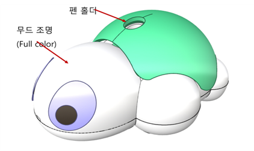

# 터틀 하드웨어 사양

터틀(Turtle)은 **바이폴라 스텝 모터로 구동하는 거북이 모양 바퀴 로봇**입니다.  
컬러 센서로 바닥의 색을 읽고, 등에 펜을 꽂아 그림을 그릴 수 있습니다.

**확장 포트가 없습니다.** 센서나 모터를 추가로 연결할 수 없습니다.

 

## 0. 문서 정보

| 항목 | 내용 |
|---|---|
| 제품명 | 터틀 (Turtle) |
| 분류 | 2륜 구동 바퀴 로봇 |
| 원본 자료 | 터틀 기술문서 |
| 이 문서가 다루지 않는 것 | BLE 패킷, 내부 모터 드라이버 통신, 데모 모드 |

 

## 1. 물리 치수

| ID | 항목 | 값 | 단위 | 비고 |
|---|---|---|---|---|
| `TURTLE.DIM.SIZE` | 크기 | 95 × 76 × 50 | mm | |
| `TURTLE.DIM.WEIGHT` | 무게 | 100 | g | |
| `TURTLE.DIM.PEN_BORE` | 펜 홀더 구멍 지름 | 약 8.0 | mm | 등에 있습니다 |

**부품 위치**

| 부위 | 내용 |
|---|---|
| 머리 | 무드 조명 (풀컬러 LED) |
| 등 | 펜 홀더, 버튼(등 전체를 누릅니다) |
| 입 아래 | 컬러 센서 (바닥을 향합니다) |
| 배 | 전원 슬라이드 스위치 |
| 꼬리 | 충전 표시등(적색), 통신 표시등(청색), Micro-USB 충전 단자 |

 

## 2. 구동계

터틀의 구동부입니다. **감속기가 없는 직접 구동**이라 펌웨어는 속도를 PPS(초당 펄스 수)로 다룹니다.  
다만 **코드에 넣는 속도 값은 `-100 ~ 100`** 입니다. 아래 PPS 값은 내부 단위이며 그대로 쓰지 않습니다. (8장 R1 참조)

| ID | 항목 | 값 | 단위 | 근거 / 비고 |
|---|---|---|---|---|
| `TURTLE.DRIVE.MOTOR` | 모터 | 바이폴라 스텝 모터 × 2 | | **직접 구동 방식. 감속기 없음** |
| `TURTLE.DRIVE.SPEED_RANGE` | 속도 지정 범위 | -1,024 ~ 1,024 | **PPS** | **백분율이 아닙니다** (초당 펄스 수) |
| `TURTLE.DRIVE.PULSE_PER_CM` | 1cm 당 펄스 | 106.8 | 펄스 | `라이브러리 보정값` 원본 문서 미공개 |
| `TURTLE.DRIVE.PULSE_SPIN` | 제자리 360° 회전 | 1,570 | 펄스 | `라이브러리 보정값` 문서의 트리밍 기본값 1,576 과 부합 |
| `TURTLE.DRIVE.PULSE_PIVOT` | 한 바퀴 고정 360° 회전 | 3,140 | 펄스 | `라이브러리 보정값` 문서의 트리밍 기본값 3,155 와 부합 |
| `TURTLE.DRIVE.ODOMETRY` | 누적 이동 거리 | 0 ~ 65,535 | 펄스 | 초과하면 0부터 다시 시작 |
| `TURTLE.DRIVE.WHEEL_DIA` | 바퀴 지름 | `미공개` | | |
| `TURTLE.DRIVE.TRACK` | 바퀴 축간거리 | `미공개` | | |
| `TURTLE.DRIVE.SPEED_MAX` | 최대 이동 속도 | `미공개` | cm/초 | 바퀴 지름이 없어 계산할 수 없습니다 |

**브레이크** — 정지했을 때 모터에 전류를 유지할지 정합니다.  
**도형을 그릴 때는 켜고**(자세 유지), 그 외에는 꺼서 전류 소모를 줄입니다.

 

## 3. 센서

| ID | 센서 | 범위 | 비고 |
|---|---|---|---|
| `TURTLE.SENSOR.COLOR` | 컬러 센서 (R · G · B) | 16비트 | **A4 용지 위에서 1023 이 되도록 보정**해 사용합니다 |
| `TURTLE.SENSOR.COLOR.BG` | 주변 밝기 (LED 소등 시) | 16비트 | **50 이하면 물체에 근접**, 100 이상이면 5mm 이상 떨어진 상태 |
| `TURTLE.SENSOR.LINE` | 라인 센서 | 0 ~ 100 | A4 용지 기준 0 = 검정, 100 = 흰색 |
| `TURTLE.SENSOR.GRAVITY` | 중력 센서 (3축) | -128 ~ 127 | **8비트.** ±2G 범위에서 1G ≈ 64 |
| `TURTLE.SENSOR.TEMP` | 온도 센서 | -40 ~ +88 °C | **기판 내부 온도** |
| `TURTLE.SENSOR.BUTTON` | 버튼 | 등 1개 | 누름 · 클릭 · 롱클릭(1.5초) · 더블 롱클릭(3초) |
| `TURTLE.SENSOR.RSSI` | 신호 세기 | -93 까지 dBm | |

> **직사광선 아래에서는 컬러 센서가 포화됩니다.** 값이 1024 를 넘으면 신뢰할 수 없습니다.  
> 실내에서 사용하도록 안내합니다.

**인식 가능한 색** — 검정 · 빨강 · 노랑 · 초록 · 하늘 · 파랑 · 자주 · 하양 (8색)  
명령 카드는 이 중 **6색**만 사용하며, 첫 색과 둘째 색이 달라야 하므로 **총 30종**입니다.

 

## 4. 출력

### 4.1 제어 가능

코드로 제어할 수 있는 터틀의 출력 장치는 아래가 전부입니다.

| ID | 항목 | 값 | 비고 |
|---|---|---|---|
| `TURTLE.OUT.LED` | 머리 LED | **1개** | 풀컬러. R · G · B 각 0 ~ 255 |
| `TURTLE.OUT.BUZZER` | 부저 주파수 | 1.0 ~ 167,772.15 Hz | **소프트웨어 상으로는 최대 6553.5 Hz 까지만 허용합니다** |
| `TURTLE.OUT.NOTE` | 음정 | 88건반, A0 ~ C8 | |
| `TURTLE.OUT.CLIP` | 내장 사운드 | 16종 + 멜로디 4종 | |

### 4.2 상태 표시등 — 제어 불가

꼬리 부분의 충전 표시등(적색)과 통신 표시등(청색)은 코드로 제어할 수 없습니다.

 

## 5. 확장 포트

**터틀에는 확장 포트가 없습니다.**  
외부 단자는 Micro-USB 충전 단자뿐이며, 센서·서보·모터를 추가로 연결할 수 없습니다.

 

## 6. 인쇄물 조건

터틀은 종이에 인쇄된 선과 색을 읽어 동작하는 기능이 많습니다.

카드 코딩이나 라인 트레이싱 코드가 제대로 동작하려면 인쇄물이 아래 조건을 만족해야 합니다.

| ID | 항목 | 값 | 단위 | 용도 |
|---|---|---|---|---|
| `TURTLE.PRINT.GRID` | 카드 코딩 격자 한 칸 | **12 × 12** | cm | 앞으로 카드 1장 = 12cm, 회전 카드 = 90° |
| `TURTLE.PRINT.LINE_WIDTH` | 라인 폭 | 6 ~ 10 | mm | **속도가 빠를수록 넓게** 그립니다 |
| `TURTLE.PRINT.INTERSECTION` | 교차로 사이 거리 | 10 이상 | cm | |
| `TURTLE.PRINT.ROAD_WIDTH` | 흰색 도로 폭 | 10 이상 | mm | 검정 중앙선 좌우 |
| `TURTLE.PRINT.PATCH` | 명령 색 칠하는 면적 | 1 × 1 | cm | |
| `TURTLE.PRINT.CARD_STRIPE` | 카드 가장자리 흰 띠 | 4 ~ 6 | mm | 자체 제작 시 |

**흰색 보정** — 컬러 센서는 **A4 용지의 흰색을 기준**으로 다른 색을 인식합니다.  
만충 직후보다 **30분 정도 사용한 뒤** 보정하면 더 정확합니다.

 

## 7. 전원과 배터리

전원 사양입니다. 동작 시간은 공개되지 않았습니다. (9.1 참조)

| ID | 항목 | 값 | 단위 | 비고 |
|---|---|---|---|---|
| `TURTLE.POWER.BATTERY` | 배터리 | Li-Poly 3.7V, 630 | mAh | |
| `TURTLE.POWER.RUNTIME` | 연속 동작 시간 | 약 1.5 | 시간 | |
| `TURTLE.POWER.STANDBY` | 대기 시간 | 최대 12 | 시간 | |
| `TURTLE.POWER.CHARGE` | 완충 시간 | 90 | 분 | |
| `TURTLE.POWER.WARN` | 저전압 경고 | 3.6 | V | 적색 LED 점멸 |
| `TURTLE.POWER.FAIL` | 동작 정지 | 3.5 | V | |

 

## 8. 코드 생성 규칙

### R1. 코드에 넣는 속도 값은 -100 ~ 100 이다 (MUST)

**`set_wheel_speed` 의 인자 범위는 `-100 ~ 100` 입니다.** 양수는 앞으로, 음수는 뒤로, 0 은 정지입니다.  
사용자 안내도 이 범위를 기준으로 되어 있으므로, **"속도 50" 이라고 하면 그대로 `50` 을 넣습니다.**

2장의 `-1,024 ~ 1,024 PPS` 는 **펌웨어 내부 단위**이며 코드에 직접 넣는 값이 아닙니다.  
`set_wheel_speed('both', 500)` 처럼 PPS 값을 그대로 쓰면 **인자 범위를 5배 벗어난 코드**가 됩니다.

**사용자가 PPS 로 요청했을 때만** 환산합니다. 최대치 1,024 PPS 가 `100` 에 대응하므로  
비례로 계산해 `-100 ~ 100` 안의 값을 넣고, **환산했다는 사실을 함께 알립니다.**

**안내 문구 예**  
> 터틀의 속도 값은 -100 ~ 100 으로 지정합니다.  
> 요청하신 500 PPS 는 최대치(1,024 PPS)의 약 절반이라 속도 값 `50` 에 해당합니다.  
> 그 값으로 작성했습니다.

### R2. 확장 포트 코드를 생성하지 않는다 (MUST NOT)

**터틀에는 확장 포트가 없습니다.** 서보·센서·LED 를 추가로 연결할 수 없습니다.  
확장 장치를 사용하는 코드를 만들지 말고, 기능이 없음을 알립니다.

### R3. 컬러 센서는 실내에서만 (MUST)

직사광선 아래에서는 값이 포화되어 색을 구분할 수 없습니다.  
색을 판단하는 코드에는 **실내 사용과 흰색 보정**이 필요함을 함께 안내합니다.

### R4. 중력 센서는 8비트다 (MUST)

터틀의 중력 센서 값은 **-128 ~ 127** 이며, ±2G 범위에서 1G 는 약 64 입니다.  
**다른 제품의 가속도 임계값을 가져와 사용하지 않습니다.**

### R5. 도형을 그릴 때는 브레이크를 켠다 (MUST)

펜을 꽂고 도형을 그리는 코드는 **브레이크를 켜서** 정지 시 자세가 틀어지지 않게 합니다.  
그 외에는 꺼서 전류 소모를 줄입니다.

### R6. 저전압에서는 동작을 보장하지 않는다 (MUST)

**3.6V 이하에서 경고가 뜨고, 3.5V 이하에서는 동작이 정지합니다.**  
도형 그리기처럼 정밀한 반복 동작을 다루는 코드에는 배터리 확인 코드를 함께 제시합니다.

### R7. 바닥 조건을 전제한다 (참고)

이동 정확도와 센서 값은 **A4 복사용지 정도의 평평한 실내 바닥**을 기준으로 합니다.  
컬러 센서의 흰색 기준도 A4 용지입니다.

 

## 9. 미공개 · 충돌 항목

### 9.1 미공개 — 추정 금지

아래 값은 **공개되지 않았습니다.**
추정하거나 임의의 숫자로 채우지 않고, 값이 없다는 사실을 그대로 알립니다.
이 값에 의존하는 코드도 만들지 않습니다.

다만 **이동 시간 · 회전 시간처럼 로봇을 돌려 보면 눈으로 바로 확인되는 값**은 예외입니다.
어림값을 출발점으로 제시하되, **사양이 아니라 추정치임을 밝히고** 직접 맞춰 보도록 안내합니다.

| 분류 | 항목 |
|---|---|
| 구동 | 바퀴 지름, 축간거리, 최대 이동 속도(cm/초) |
| 구동 | 모터 스텝 각, 바퀴 1회전 펄스 수 |
| 성능 | 최소 회전 반경, 최대 적재 하중, 등판 각도 |
| 기타 | 펜 압력, 그리기 모드의 도형 크기 |

### 9.2 충돌 — 채택값과 다른 표기

원본 자료에 따라 값이 다르게 적힌 항목입니다.
코드와 설명에는 **채택값만** 사용합니다.

| 항목 | 채택값 | 다른 표기 |
|---|---|---|
| 내장 사운드 수 | 16종 + 멜로디 4종 | 사운드 표에는 17 + 5 |
| 중력 센서 1G 값 | 64 | 원본 문서에 `-64(0x80)` 로 적혀 있으나 0x80 은 -128 입니다 |

 

## 10. 관련 문서

- [제품 하드웨어 사양 목록](README.md)  
- [파이썬 API 메뉴얼 - 터틀](https://github.com/RobomationLAB/Robomation_Python/wiki/Turtle)  
- [RobomationLAB 사용 가이드 - 터틀](../docs/pages/ko/roboids/Turtle.md)
